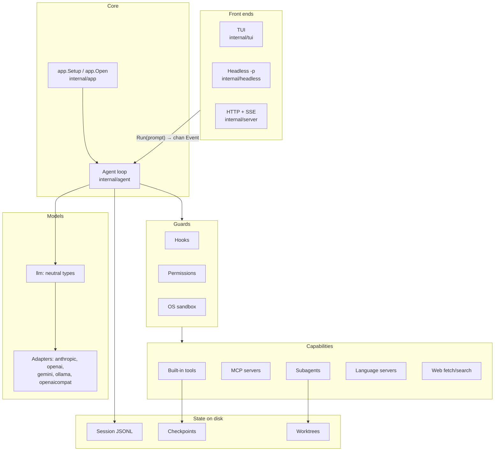

# Larik internals

These docs explain how Larik works inside: what each package does, how a prompt becomes model calls and tool runs, where state lives, and why it was built this way. They are written for contributors. For usage (flags, commands, config keys), see the [top-level README](../README.md).

## Reading order

| # | Doc | Read it to learn |
|---|---|---|
| 1 | [Architecture](architecture.md) | The package map, the core types, and how the process starts |
| 2 | [The agent loop](agent-loop.md) | What happens between sending a prompt and the turn ending |
| 3 | [Tools and permissions](tools-and-permissions.md) | How tool calls are authorized, run in parallel, and reported |
| 4 | [Providers](providers.md) | The provider-neutral message model and the adapters |
| 5 | [State and persistence](state-and-persistence.md) | Sessions, branches, compaction, checkpoints, config layers |
| 6 | [Extensibility](extensibility.md) | Subagents, worktrees, background tasks, MCP, skills, hooks, LSP |
| 7 | [Security model](security.md) | The sandbox, trust boundaries, and what each protects against |
| 8 | [Server mode](server-mode.md) | The HTTP + SSE API and how it wraps an agent |
| 9 | [How Larik compares](comparison.md) | Design choices that set it apart from other agent harnesses |
| 10 | [Contributing guide](contributing-guide.md) | Recipes: add a tool, a provider, a command, a hook event |

## The mental model on one page

Larik is a **loop around a model**. The user sends a prompt; the agent sends the conversation to a model; the model answers with text, or with tool calls; the agent runs the tools and sends the results back; this repeats until the model answers without calling a tool.

Everything else hangs off that loop:

- **Front ends** (terminal UI, `-p` headless mode, HTTP server) never touch the loop. They read one stream of `Event`s and answer permission requests. See [architecture](architecture.md#one-event-stream-three-front-ends).
- **Providers** (Anthropic, OpenAI, Gemini, Ollama, any OpenAI-compatible server) translate one neutral message format to each vendor's API. See [providers](providers.md).
- **Tools** (read, write, edit, bash, grep, glob, web, lsp, skills, MCP, task) share one small interface. See [tools](tools-and-permissions.md).
- **Guards** sit between the model and the tools: hooks, permission rules and modes, and the OS sandbox. See [security](security.md).
- **State** is append-only: a JSONL transcript per session, file snapshots per turn for `/undo`, and git worktrees for isolated subagents. See [state](state-and-persistence.md).



## Glossary

| Term | Meaning |
|---|---|
| **Turn** | Everything that happens for one user prompt: possibly many model requests and tool rounds. One turn is one `/undo` unit. |
| **Model turn / round** | One request to the model and, if it asked for tools, one batch of tool runs. `MaxTurns` (default 200) bounds these per turn. |
| **Context** | The messages currently sent to the model. `/clear` empties it; compaction replaces it with a summary. The session file keeps everything. |
| **Block** | One piece of a message: text, thinking, tool_use, tool_result, image, or opaque. `llm.Block` is a flat union so it round-trips through JSON. |
| **Opaque block** | A provider-specific item (for example an OpenAI encrypted reasoning item) that is replayed verbatim to the same provider and model, and dropped for everyone else. |
| **Event** | What the agent emits while it works: text deltas, tool start/end, permission requests, usage, notices, done. Every front end consumes the same events. |
| **Checkpoint** | The original bytes of a file, saved just before the first write to it in a turn, so `/undo` can restore it. |
| **Branch** | A new session file that starts with a copy of another session's messages and records `fork_of`. Made by `/fork`, `/rewind` or `--fork`. |
| **Subagent** | A child `Agent` with a fresh context, its own prompt and a restricted tool set, started by the `task` tool. |
| **Worktree subagent** | A subagent that works in its own git worktree on a new `larik/task-*` branch. |
| **Background task** | A subagent started with `run_in_background`; its result comes back later as a `<task-notification>`. |
| **Personal vs shared config** | Personal files (`~/.config/larik/config.json`, `~/.config/larik/projects/`) are trusted. Shared files (`.larik/settings.json`, `.mcp.json`) may only tighten security. |

## Source map

```
cmd/larik           main.go (flags, TUI or -p), serve.go (larik serve), bench.go (larik bench)
internal/app        process-wide setup; opens sessions into agents
internal/agent      the loop, events, tool dispatch, compaction, subagent spawn, background tasks
internal/llm        neutral types, catalog, retry; one subpackage per provider
internal/providers  "provider/model" resolution and provider construction
internal/tools      read, write, edit, bash, grep, glob; Registry and Env
internal/permission modes and allow/deny rules
internal/hooks      Claude Code–compatible lifecycle hooks
internal/sandbox    Seatbelt (macOS) and bubblewrap (Linux)
internal/session    append-only JSONL transcripts and branches
internal/checkpoint per-turn file snapshots for /undo
internal/subagent   task / task_wait / task_stop tools, agent definitions
internal/worktree   git worktrees for isolated subagents
internal/mcp        MCP client and tool adapter
internal/skills     Agent Skills discovery and the skill tool
internal/lsp        language server client, diagnostics after edits, lsp tool
internal/web        web_fetch and web_search
internal/config     layered settings with a trust model
internal/chatgpt    ChatGPT (Codex) OAuth sign-in
internal/headless   -p mode
internal/server     HTTP + SSE API
internal/bench      self-checking tasks for comparing models (larik bench)
internal/tui        Bubble Tea UI
```
