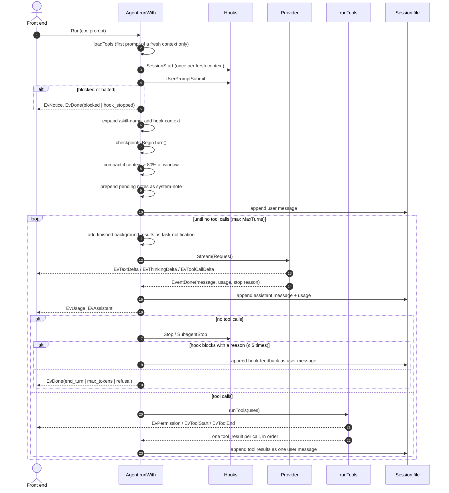
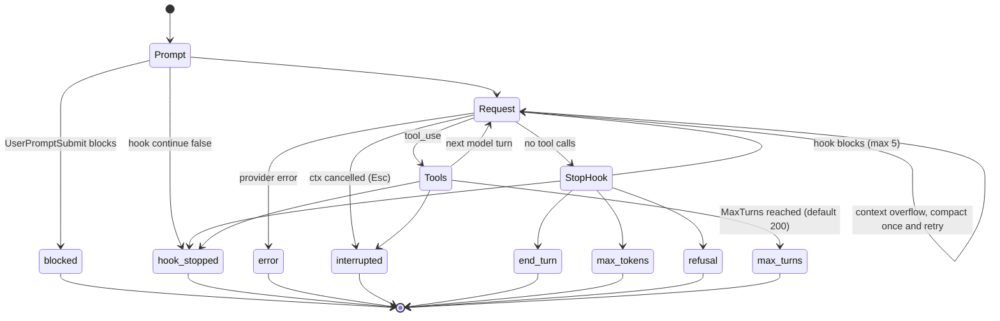

# The agent loop

The whole loop is `Agent.runWith` in [internal/agent/agent.go:255](../internal/agent/agent.go:255), about 120 lines. This page walks through it in order.

## One turn, step by step

### 1. Load tools once per context

`loadTools` ([agent.go:208](../internal/agent/agent.go:208)) calls `Options.LoadTools`, which in practice is `mcp.Manager.Registry`: it waits (bounded) for MCP servers to connect and returns the built-in tools plus every connected server's tools, sorted by name. It runs on the first prompt and again only after `Clear`. The tool set then stays fixed, so the tool definitions (which sit near the start of every request) don't change and the provider's prompt cache stays valid. An MCP server that finishes connecting later joins after `/clear`.

### 2. Session and prompt hooks

`SessionStart` fires once per fresh context, with source `startup`, `resume` or `clear`. Its output becomes a note delivered with the next user message. `UserPromptSubmit` can block the prompt, halt, or add context. Both are skipped for subagents and for turns Larik starts itself (background notifications). See [hooks](extensibility.md#hooks).

### 3. Skill expansion

A prompt like `/release-notes v2` is replaced by the skill's instructions with `$ARGUMENTS` filled in (`skills.Set.Expand`).

### 4. Checkpoint boundary

`Checkpoints.BeginTurn()` starts a new undo unit. Subagents don't call it: their edits belong to the parent's turn, so one `/undo` reverts both.

### 5. Compaction before the request

`needsCompaction` ([agent.go:481](../internal/agent/agent.go:481)) is true when the last request used more than 80% of the context window (`compactThreshold`) and there are at least four messages. The window is the one the provider reported (Ollama, LM Studio) or else the catalog's. See [compaction](#compaction).

### 6. Notes

Some events can't be sent to the model when they happen without rewriting history: an `/undo`, or `SessionStart` context. They are queued in `a.notes` and prepended to the next user message inside `<system-note>`. The transcript stays append-only.

### 7. The model turn loop

Each iteration:

1. **Background results.** Finished background tasks are formatted as `<task-notification>` blocks and appended as a user message, so they ride along with the next request ([background.go:209](../internal/agent/background.go:209)).
2. **Stream.** `stream` ([agent.go:381](../internal/agent/agent.go:381)) builds an `llm.Request` from a copy of the messages, calls `Provider.Stream`, and forwards deltas as events. The deltas are only for display. The final `EventDone` carries the assembled message, which is what gets stored. It also measures thinking time (request sent → first text or tool call) and records usage and cost.
3. **No tool calls → maybe stop.** The `Stop` hook (or `SubagentStop`) may block with a reason; the reason goes back as a `<hook-feedback>` user message and the loop continues. This is capped at 5 continuations (`maxStopContinuations`), and `stop_hook_active` tells the hook it already fired.
4. **Tool calls → run them.** `runTools` returns one `tool_result` block per call, in the original order, and they're appended as a single user message. See [tools](tools-and-permissions.md).
5. **Halt check.** A hook that returned `continue: false` during the tool round ends the turn now.

## How a turn ends

`runWith` returns a stop reason, which becomes `EvDone.StopReason`:

### Interrupts

Esc cancels the turn's context. If text was already streaming, `keepPartial` ([agent.go:454](../internal/agent/agent.go:454)) stores it with `[interrupted by user]` so the transcript matches what the user saw. Tool calls that hadn't started get `interrupted by user` results, so every `tool_use` still has a matching `tool_result`. `llm.Append` merges a following user prompt into the trailing user message so roles keep alternating.

### Errors and retries

- **Transient API errors** (408, 409, 429, 5xx) are retried below the loop. The Anthropic and OpenAI SDKs retry on their own; the Gemini adapter is wrapped in `llm.WithRetry` (4 attempts, exponential backoff), which retries only if nothing has been shown yet: once a delta reached the screen, the error is surfaced ([retry.go](../internal/llm/retry.go)).
- **Context overflow** (`llm.ErrContextOverflow`, which adapters return when the prompt is too long) triggers one compaction and one retry per turn.
- **Truncated tool input** (possible with Anthropic's eager input streaming) arrives with `Input == nil`; the tool result tells the model to retry with complete JSON rather than failing the turn.

## Compaction

Compaction ([agent.go:509](../internal/agent/agent.go:509)) asks the same model, with the same system prompt and tools, to summarize the conversation inside `
` tags. Using the same prefix means the request itself hits the prompt cache. The prompt asks it to keep the user's words close to verbatim and condense the assistant's own reasoning.

Then the entire message list is replaced with one user message: "This session continues from an earlier conversation that was summarized…" plus the summary. Nothing from before is replayed. A `compaction` entry is appended to the session file, so resuming reconstructs the same state. Mid-turn compaction adds "Continue the task from where it left off."

Triggers: automatic at 80% (unless `auto_compact` is off), on context overflow, and `/compact`. `PreCompact` hooks fire first.

## Why the loop looks like this

Three invariants shape most of the code above:

1. **The prompt prefix is stable.** System prompt, tools and earlier messages don't change within a context, so every request after the first reads from the provider's cache. That's why tools load once per context, why the language setting waits for `/clear`, why undo is a note instead of an edit, and why compaction is a single clean cut.
2. **The transcript is append-only.** Nothing already sent is ever rewritten. Resume, fork and rewind all read the same file, and provider rules that bind thinking blocks to their exact prefix (Anthropic) keep holding.
3. **The loop knows nothing about the UI.** Everything observable is an `Event`; everything interactive is a reply channel.
