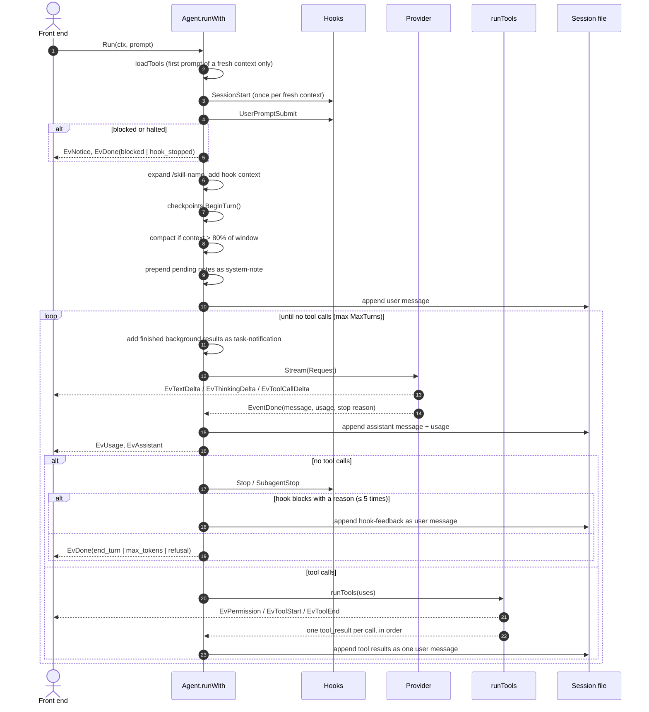
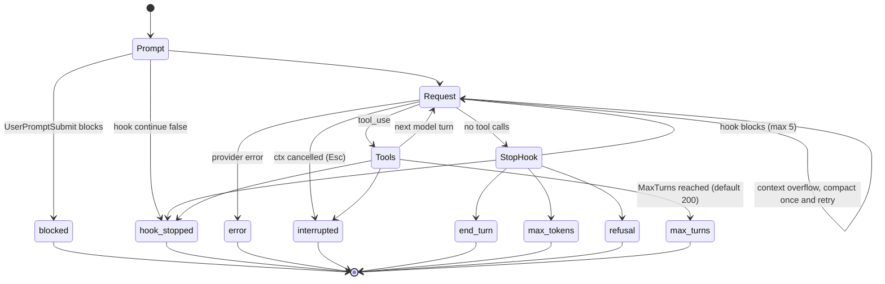

# The agent loop

The whole loop is `Agent.runWith` in [internal/agent/agent.go:255](../internal/agent/agent.go:255), about 120 lines. This page walks through it in order.

## One turn, step by step

### 1. Load tools once per context

`loadTools` ([agent.go:208](../internal/agent/agent.go:208)) calls `Options.LoadTools`, which in practice is `App.loadTools`: it waits (bounded) for MCP servers to connect and returns the built-in tools plus every connected server's tools, sorted by name, plus the `skill` tool when skills exist. It runs on the first prompt and again only after `Clear`. The tool set then stays fixed, so the tool definitions (which sit near the start of every request) don't change and the provider's prompt cache stays valid. An MCP server that finishes connecting later joins after `/clear`.

### 2. Session and prompt hooks

`SessionStart` fires once per fresh context, with source `startup`, `resume` or `clear`. Its output becomes a note delivered with the next user message. `UserPromptSubmit` can block the prompt, halt, or add context. Both are skipped for subagents and for turns Larik starts itself (background notifications). See [hooks](extensibility.md#hooks).

### 3. Skill expansion

A prompt like `/release-notes v2` is replaced by the skill's instructions with `$ARGUMENTS` filled in (`skills.Set.Expand`).

### 4. Checkpoint boundary

`Checkpoints.BeginTurn()` starts a new undo unit. Subagents don't call it: their edits belong to the parent's turn, so one `/undo` reverts both.

### 5. Compaction before the request

`needsCompaction` ([agent.go:481](../internal/agent/agent.go:481)) is true when the last request used more than 80% of the context window (`compactThreshold`) and there are at least four messages. The window is the one the provider reported (Ollama, LM Studio) or else the catalog's. See [compaction](#compaction).

### 6. Notes

Some events can't be sent to the model when they happen without rewriting history: an `/undo`, or `SessionStart` context. They are queued in `a.notes` and prepended to the next user message inside `<system-note>`. The transcript stays append-only.

### 7. The model turn loop

Each iteration:

1. **Background results.** Finished background tasks are formatted as `<task-notification>` blocks and appended as a user message, so they ride along with the next request ([background.go:209](../internal/agent/background.go:209)).
2. **Stream.** `stream` ([agent.go:381](../internal/agent/agent.go:381)) builds an `llm.Request` from a copy of the messages, calls `Provider.Stream`, and forwards deltas as events. The deltas are only for display. The final `EventDone` carries the assembled message, which is what gets stored. It also measures thinking time (request sent → first text or tool call) and records usage and cost.
3. **No tool calls → maybe stop.** The `Stop` hook (or `SubagentStop`) may block with a reason; the reason goes back as a `<hook-feedback>` user message and the loop continues. This is capped at 5 continuations (`maxStopContinuations`), and `stop_hook_active` tells the hook it already fired.
4. **Tool calls → run them.** `runTools` returns one `tool_result` block per call, in the original order, and they're appended as a single user message. See [tools](tools-and-permissions.md).
5. **Halt check.** A hook that returned `continue: false` during the tool round ends the turn now.

Two tools change the loop's state rather than the project:

- **`exit_plan_mode`** is read-only, so plan mode lets the model call it, but it always goes to the permission prompt. The prompt is the plan approval: a yes switches to the mode the user picked and the tool result tells the model to carry out the plan; a no keeps plan mode and returns the user's feedback ([runtools.go](../internal/agent/runtools.go), [plan.go](../internal/agent/plan.go)).
- **`todo_write`** keeps the task list in the transcript itself, so nothing else stores it. Compaction carries over the unfinished items, since the summary replaces the messages that held them ([agent.go](../internal/agent/agent.go)).

### Debug traces

With debug mode on, the agent has a `trace.Tracer`. It wraps the event stream, so tool starts and ends, notices and errors are recorded as they are emitted, and it records each request as sent, the response with its timing, usage and cost, and each permission answer ([trace.go](../internal/agent/trace.go)). Subagents get a child tracer that names its parent, so the viewer can nest their requests. With no tracer, every call is a no-op. See [debug mode](../README.md#debug-mode-and-traces).

## How a turn ends

`runWith` returns a stop reason, which becomes `EvDone.StopReason`:

### Repeating itself

`loopGuard` ([loop.go](../internal/agent/loop.go)) hashes each round of tool calls together with their results. The same round four times within the last eight means the agent is stuck, and `loopStop` decides what happens:

- A **subagent**, an **unattended** run (`-p`, `larik serve`: `Options.Unattended`) and a session in **auto** or **yolo** mode have nobody to press Esc, so the turn ends with stop reason `loop`.
- In an ordinary interactive session the user is watching: Larik shows one notice per turn and carries on.

Matching the results keeps honest retries apart: rerunning tests after an edit gives different output.

### Interrupts

Esc cancels the turn's context. If text was already streaming, `keepPartial` ([agent.go:454](../internal/agent/agent.go:454)) stores it with `[interrupted by user]` so the transcript matches what the user saw. Tool calls that hadn't started get `interrupted by user` results, so every `tool_use` still has a matching `tool_result`. `llm.Append` merges a following user prompt into the trailing user message so roles keep alternating.

### Errors and retries

- **Transient API errors** (408, 409, 429, 5xx) are retried below the loop. The Anthropic and OpenAI SDKs retry on their own; the Gemini and Ollama adapters are wrapped in `llm.WithRetry` (4 and 3 attempts, exponential backoff), which retries only if nothing has been shown yet: once a delta reached the screen, the error is surfaced ([retry.go](../internal/llm/retry.go)). A wait the server asks for (`Retry-After`, or Gemini's `RetryInfo`) is honored; past a minute the error is surfaced instead.
- **A server that goes quiet.** Every provider is wrapped in `llm.WithStallTimeout` ([stall.go](../internal/llm/stall.go)). It puts a timer in the request's context, and the shared HTTP transport runs it while waiting for the response headers and during each read of the body; if no byte arrives for `stall_timeout` (5 minutes, 15 for local servers), the request is cancelled and fails with `*llm.StallError`. That error is a `net.Error` timeout, so a fallback chain switches models when nothing has been shown yet; otherwise the turn ends with the error. After a stall the transport refuses the SDK's own connection retries, which would each wait the timeout again.
- **Context overflow** (`llm.ErrContextOverflow`, which adapters return when the prompt is too long) triggers a compaction and one retry. A long turn can compact again later, once the previous compaction brought the context back under the threshold; one that didn't isn't repeated. A *failed* compaction is tracked separately from a successful one: the threshold compaction isn't attempted again until one succeeds (it would fail on every request of a long turn), but overflow recovery stays armed, because it is the only thing left that can get an oversized request through. An overflow compaction that fails ends the turn, since there is no way to continue without it.
- **Truncated tool input** (possible with Anthropic's eager input streaming) arrives with `Input == nil`; the tool result tells the model to retry with complete JSON rather than failing the turn.

## Compaction

Compaction ([agent.go:509](../internal/agent/agent.go:509)) asks the same model, with the same system prompt and tools, to summarize the conversation inside `
` tags. Using the same prefix means the request itself hits the prompt cache. The prompt asks it to keep the user's words close to verbatim and condense the assistant's own reasoning.

Then the entire message list is replaced with one user message: "This session continues from an earlier conversation that was summarized…" plus the summary, plus the path of the session file with a hint to grep it for exact details (a command, an error, a path) the summary left out. Nothing from before is replayed, but it stays one `grep` away. A `compaction` entry is appended to the session file, so resuming reconstructs the same state. Mid-turn compaction adds "Continue the task from where it left off."

Triggers: automatic above 80% (unless `auto_compact` is off), on context overflow, and `/compact`. `PreCompact` hooks fire first.

### Deciding when the context is full

`needsCompaction` ([agent.go](../internal/agent/agent.go)) compares two numbers against the same 80% threshold and takes the larger:

- `lastContext`, what the provider reported for the previous request (`Input + CacheRead + CacheWrite + Output`: the prompt it measured, plus the reply that has since joined it). Accurate, but it knows nothing about anything appended since — a large pasted prompt, a long tool result, a batch of background results — and a resumed session has no measurement at all.
- An estimate of what is about to be sent ([estimate.go](../internal/agent/estimate.go)): four characters per token over the system prompt, tool definitions and messages, with a flat cost per image so a screenshot's base64 isn't measured as text. It errs low, deliberately — an estimate that compacted a conversation that still fits would destroy work, while one that is too cautious only falls back on the provider's overflow error. Nothing estimated is ever displayed: every token count a user sees comes from a provider.

One case is excluded. Compaction replaces the conversation and keeps the system prompt and tool definitions, so when those alone are already over the threshold — as they can be on a small local window — summarizing frees nothing and would run again on the very next turn. The estimated prefix is checked first and compaction is skipped.

The summary's own length is capped at 32k tokens, the writing model's maximum output, and a quarter of the window being freed (never below 1k): a summary that fills the context it is meant to free is not a compaction.

A successful compaction emits provider-grounded telemetry such as `26k prompt → ~10k summary · ~16k saved`. The first value is the summarizer request's reported input size; the second is its billed output, which can include hidden reasoning on providers that account for it separately. The summary and difference are marked as estimates because the rebuilt context also includes the stable system/tool prefix, the continuation wrapper, and any carried todo list. The next normal model request replaces the context display with its exact provider-reported size. Compaction count and cumulative measured savings are restored with the session; compactions from providers that report no usage are counted but do not contribute a zero-valued savings claim.

## Why the loop looks like this

Three invariants shape most of the code above:

1. **The prompt prefix is stable.** System prompt, tools and earlier messages don't change within a context, so every request after the first reads from the provider's cache. That's why tools load once per context, why the language setting waits for `/clear`, why undo is a note instead of an edit, and why compaction is a single clean cut.
2. **The transcript is append-only.** Nothing already sent is ever rewritten. Resume, fork and rewind all read the same file, and provider rules that bind thinking blocks to their exact prefix (Anthropic) keep holding.
3. **The loop knows nothing about the UI.** Everything observable is an `Event`; everything interactive is a reply channel.
