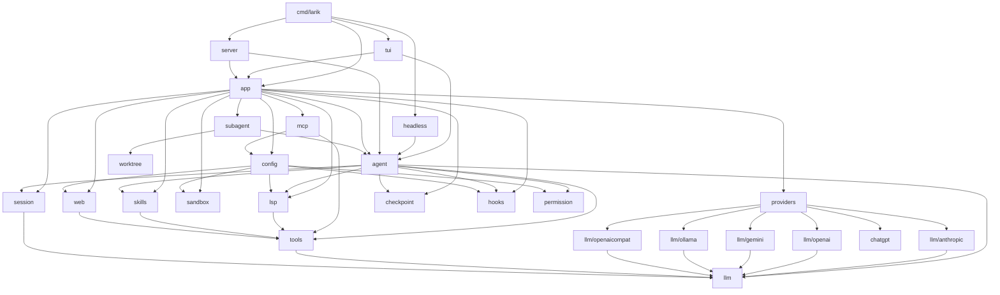
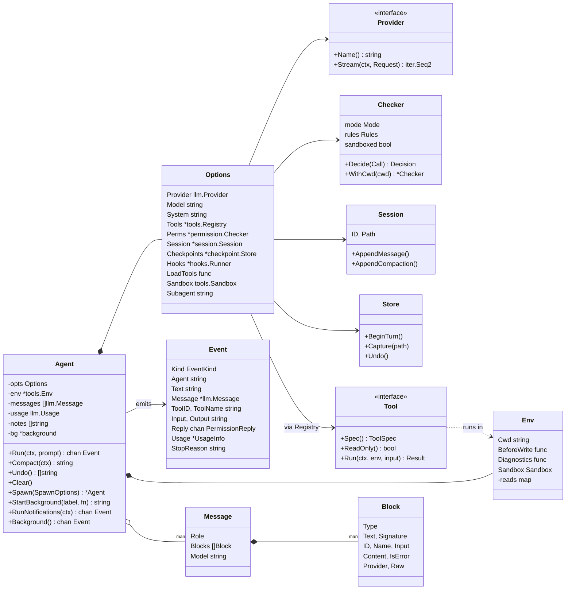
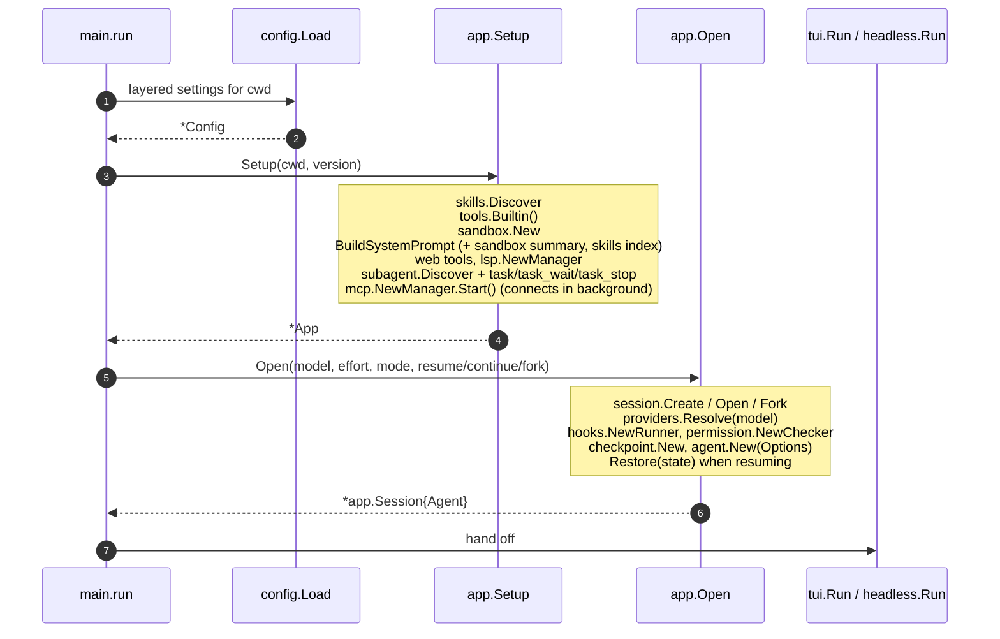
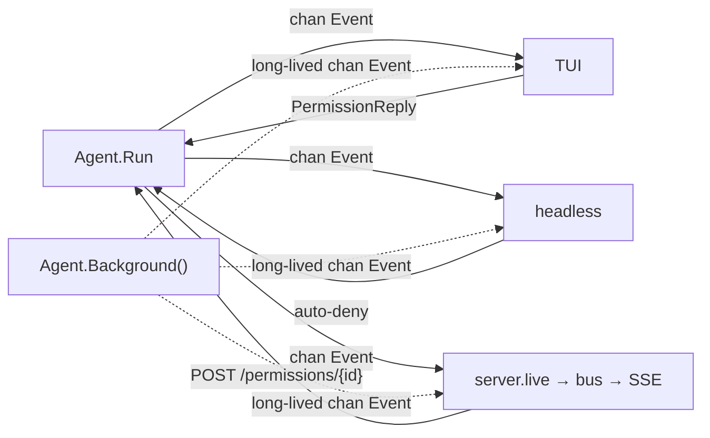

# Architecture

Larik is one Go binary, `cmd/larik`, built from about 20 internal packages. This page covers how those packages depend on each other, the core types, how the process starts, and the rule that keeps the loop independent of the UI.

## Package dependencies

Dependencies point one way: from the entry point, through `app`, into `agent`, and down to the leaf packages. `agent` imports no front end. `llm` imports no vendor SDK; only its subpackages do.

Two packages close cycles that Go would otherwise forbid, through small interfaces:

- `tools` defines `Sandbox` (`Command(script, dir) *exec.Cmd`), which `sandbox.Sandbox` satisfies. `tools` never imports `sandbox`.
- `subagent` imports `agent`, but `agent` does not import `subagent`. A running tool reaches its agent through the context: `agent.FromContext(ctx)` ([spawn.go:25](../internal/agent/spawn.go:25)).

## Core types

Where they live:

| Type | File |
|---|---|
| `Agent`, `Options` | [internal/agent/agent.go](../internal/agent/agent.go) |
| `Event`, `PermissionReply`, `UsageInfo` | [internal/agent/event.go](../internal/agent/event.go) |
| `Provider`, `StreamEvent`, `ModelProber` | [internal/llm/provider.go](../internal/llm/provider.go) |
| `Message`, `Block`, `Request`, `Usage` | [internal/llm/types.go](../internal/llm/types.go) |
| `Tool`, `Env`, `Registry`, `Sandbox` | [internal/tools/tool.go](../internal/tools/tool.go) |
| `Checker`, `Mode`, `Rules` | [internal/permission/permission.go](../internal/permission/permission.go) |
| `Session`, `Entry`, `State` | [internal/session/session.go](../internal/session/session.go) |
| `Store` | [internal/checkpoint/checkpoint.go](../internal/checkpoint/checkpoint.go) |

## Startup

`main.run` ([main.go:37](../cmd/larik/main.go:37)) does four things:

1. Parse flags. `larik serve` branches off to `runServe` before flag parsing.
2. Load config. If nothing is configured and stdin/stdout are terminals, run the first-start wizard (`tui.RunSetup`).
3. `app.Setup(cwd)` builds the process-wide services once.
4. `app.Open(...)` creates or resumes a session and builds its `Agent`. Then hand off to `headless.Run` (for `-p`) or `tui.Run`.

`App` holds what every session in a directory shares: MCP connections, language servers, the sandbox, skills, agent definitions and the tool list ([app.go:29](../internal/app/app.go:29)). `app.Session` holds what one conversation owns: its `Agent`, its hook runner, and its session file. `larik serve` keeps one `App` and many `Session`s.

The system prompt is built by `App.SystemPrompt` for each fresh context (a new session, or `Agent.Clear` through `Options.BuildSystem`) and never changes within one. It is `basePrompt` + an `<env>` block (cwd, platform, date, git root) + every `AGENTS.md`/`CLAUDE.md` from the repo root down to cwd + the sandbox summary + the skills index, rescanned each time ([prompt.go](../internal/agent/prompt.go)). Keeping it byte-stable is what lets provider prompt caches hit on every request.

## One event stream, three front ends

`Agent.Run(ctx, prompt)` returns `<-chan Event` and runs the turn in a goroutine ([agent.go:243](../internal/agent/agent.go:243)). The caller has exactly two duties:

1. Drain the channel until it closes (after `EvDone`).
2. Answer every `EvPermission` by sending one `PermissionReply` on `event.Reply`.

That contract is the only coupling between the loop and the UI. Each front end fulfils it differently:

| Front end | Renders events as | Answers permissions by |
|---|---|---|
| TUI ([tui/app.go](../internal/tui/app.go)) | Bubble Tea messages: streaming text, tool rows, a status bar | Showing a prompt; several queued when subagents ask at once |
| Headless ([headless/print.go](../internal/headless/print.go)) | Plain text, or one JSON object per line with `--output json` | Denying automatically (use `--mode` or allow rules up front) |
| Server ([server/live.go](../internal/server/live.go)) | SSE messages with a sequence number | Holding the reply channel until a client POSTs an answer |

There is a second, long-lived channel: `Agent.Background()` ([background.go:66](../internal/agent/background.go:66)). A turn's channel closes when the turn ends, but background subagents keep running, so their events (and their permission requests) go to this channel instead. Every front end reads it for the agent's whole life.

Because the event schema is shared, `-p --output json` and the SSE stream carry the same objects, and a new front end needs no changes to the loop.

## Concurrency

- One turn at a time per `Agent`. The TUI and server refuse a new prompt while one runs (the server returns 409).
- `Agent.mu` guards messages, usage and options. It is never held across a model request or a tool run; `stream` copies the messages under the lock and releases it before streaming ([agent.go:381](../internal/agent/agent.go:381)).
- Tools run in parallel only when they are read-only or declare `ConcurrencySafe` ([tool.go:174](../internal/tools/tool.go:174)). See [tools](tools-and-permissions.md#execution-order).
- Hooks for one event run in parallel; their results are combined.
- Subagents run in their own goroutine inside the `task` tool call. Several `task` calls in one model turn run in parallel because `task` reports itself as read-only.
- Cancellation is a `context.Context` all the way down: Esc cancels the turn's context, which stops the stream, kills bash process groups, and interrupts subagents. Background tasks have their own context and survive Esc.
