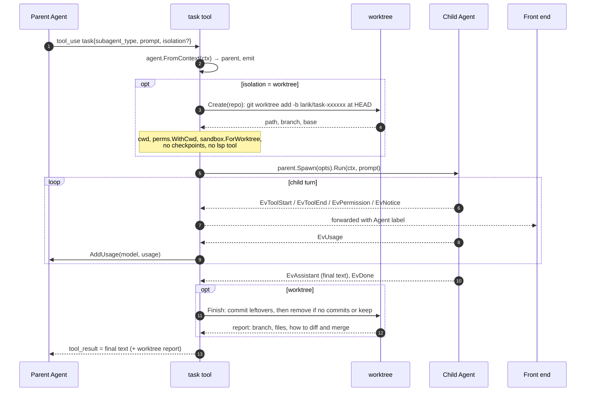
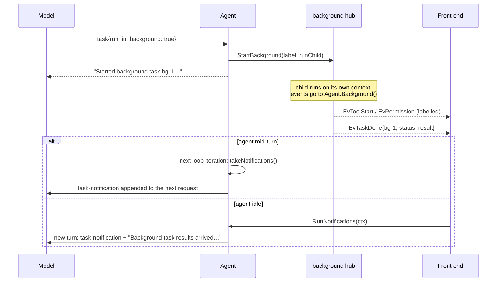
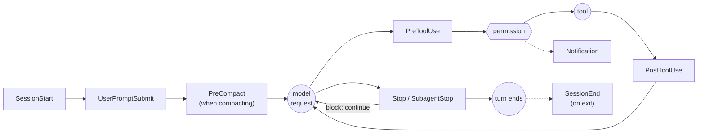

# Extensibility

Larik has seven extension mechanisms. Most either **add tools** to the registry or **run at points in the loop**; the TUI panels customize what you see without adding model tools.

| Mechanism | Seam | Configured by | Package |
|---|---|---|---|
| Subagents | the `task` tool | `.larik/agents/*.md`, `.claude/agents/*.md` | [subagent](../internal/subagent), [worktree](../internal/worktree) |
| MCP servers | tools named `mcp__server__tool` | `mcp_servers`, `.mcp.json` | [mcp](../internal/mcp) |
| Skills | system-prompt index + the `skill` tool + `/name` expansion | `SKILL.md` folders | [skills](../internal/skills) |
| Hooks | lifecycle points in the loop | `hooks` in settings | [hooks](../internal/hooks) |
| Language servers | edit/write results + the `lsp` tool | `lsp` in settings, or on `PATH` | [lsp](../internal/lsp) |
| Web | `web_fetch`, `web_search` tools | env keys, `web` in settings | [web](../internal/web) |
| TUI panels | footer status line + `/info` sidebar display | `status_line`, `sidebar` commands | [tui](../internal/tui) |

## Custom TUI panels

The TUI has two display-only customization points. `status_line` adds command output to the footer's left side while keeping Larik's model/context/cost and safety information on the right; `sidebar` adds command output below the built-in `/info` sections. Both commands receive the session JSON on stdin and may inspect the project (for example, to show Git changes). The payload includes Larik's `larik.activity`, `larik.active_tool`, `larik.turn_running` and `larik.background_tasks` fields, so a script can render activity-specific text or a simple animation.

Configure them in personal settings only, since each setting runs a shell command:

```json
{
  "status_line": {
    "type": "command",
    "command": "~/.config/larik/status.sh",
    "refresh_interval_ms": 1000
  },
  "sidebar": {
    "type": "command",
    "command": "~/.config/larik/sidebar.sh",
    "refresh_interval_ms": 1000
  }
}
```

The interval defaults to one second and accepts 300–60000 milliseconds. Commands run when session state changes and are polled at that interval; they have a five-second timeout. The sidebar command runs only while the sidebar is open. Footer output is limited to three lines and sidebar output to twelve lines, with output bytes capped. The footer's first custom line shares the row with Larik's built-in right-side information; additional custom lines appear below it. A shared `.larik/settings.json` cannot cause these commands to execute. These hooks customize displayed information; they do not add interactive TUI widgets or model tools. Use MCP or Larik's tool extension points for actions. See [Custom sidebar](../README.md#custom-sidebar) and [Status line](../README.md#status-line) for examples.

## Subagents

The `task` tool ([task.go](../internal/subagent/task.go)) lets the model delegate. A subagent is a full `Agent`, created with `parent.Spawn` ([spawn.go:50](../internal/agent/spawn.go:50)).

**What the child gets:**

- A fresh context (it can't see the conversation, so the prompt must be self-contained).
- A system prompt: the definition's body + a footer asking for a complete final report + the skills index, when the definition allows the `skill` tool + the shared context: the main prompt's safety rules, the env block, instructions, the `<sandbox>` summary and the date.
- The parent's tools filtered by the definition's `tools` list, minus `task`, `task_wait` and `task_stop` (no nesting).
- A model chosen by the task's `model` input, else the definition's `model`, else the parent's ([`Tool.model`](../internal/subagent/task.go)). Either can name a role (`worker`, `explore`, …) or a `provider/model`. The built-ins default to the `worker` and `explore` roles, and an unset role inherits. The task tool reads roles through `Tool.Roles` on every request, so `/routing` changes apply without a restart, and offers the `model` input only once some role has a model. Unmapped `opus`/`sonnet`/`haiku` aliases resolve only on Anthropic; elsewhere the child falls back to the parent's model with a notice.
- At most 100 model turns, or the role's `max_turns`. When the cap is hit, or the loop guard ([loop.go](../internal/agent/loop.go)) sees the same calls with the same results 4 times in 8 turns, the parent gets an error result telling it to check the child's changes, followed by the child's last message.
- Its own worktree when its role has `isolation: "worktree"` and neither the task nor the definition sets isolation. Only inside a git repository; elsewhere it works in place, with a notice.
- A smaller shared context when its role has `context: "minimal"`: `Tool.MinimalContextFunc` ([app.go](../internal/app/app.go)) in place of `ContextFunc`, built from `agent.MinimalContextSections` ([prompt.go](../internal/agent/prompt.go)) — the safety rules, the env block, this project's own `AGENTS.md`/`CLAUDE.md` and the `<sandbox>` summary, without the user's global instruction file or the skills index.

**What it shares with the parent:** the permission checker (same mode and rules), hooks (with `SubagentStop` instead of `Stop`), the checkpoint store, language servers and the sandbox. Its usage is added to the parent's totals, priced for the model that served each request (`UsageInfo.Model`). A transcript is saved under `<session>-agents/`. The parent's session budget covers it too: `checkBudget` ([budget.go](../internal/agent/budget.go)) walks up to the root agent, whose cost already includes every subagent's spend.

**What comes back:** only the child's final text message, truncated to the tool output cap. Tool calls and permission prompts are forwarded as events labelled `Agent: "explore: find auth"`, so the UI can nest them, but they never enter the parent's context.



`task` reports itself as read-only. The call itself changes nothing (every tool call inside the child is checked on its own), and read-only tools run in parallel, so several `task` calls in one response run as parallel subagents.

### Worktree isolation

With `isolation: "worktree"` (or `isolation: worktree` in the definition), the child works in its own checkout ([worktree.go](../internal/worktree/worktree.go)):

- Created under `~/.local/share/larik/worktrees/` from the current `HEAD`, on branch `larik/task-xxxxxx`. Uncommitted changes in your checkout are not included.
- The child's cwd, relative paths and path rules point into the worktree. Writes elsewhere ask for permission like any path outside cwd.
- The sandbox is re-derived with `ForWorktree`: writable are the worktree and the repo's shared `.git` (so commits work), while `.git/hooks`, `.git/config` and the other git files that choose which code git runs stay read-only.
- On finish, leftover changes are committed (with `--no-verify`, falling back to a Larik identity). No commits → worktree and branch are deleted. Otherwise both are kept and the result tells the parent how to review (`git diff base...branch`) and merge.
- Git operations on the shared repo are serialized with a per-repo lock, so parallel tasks can start and finish safely.

### Background tasks

With `run_in_background: true`, `task` calls `parent.StartBackground` ([background.go:78](../internal/agent/background.go:78)) and returns `bg-N` immediately. At most 8 run at once.



The model can also block with `task_wait` (all tasks or specific ids) or cancel with `task_stop`. Background tasks survive Esc on the foreground turn; `/tasks stop` or quitting stops them. In `-p` mode Larik exits only after every task has finished and been delivered.

### Definitions

Files are `<name>.md` with YAML frontmatter (`name`, `description`, `tools`, `model`, `isolation`) and a body that becomes the system prompt, the same format as Claude Code. Discovery ([defs.go](../internal/subagent/defs.go)), lowest to highest precedence: `~/.claude/agents`, `~/.config/larik/agents`, then `.claude/agents` and `.larik/agents` in each directory from the repo root down to cwd. Built-ins: `general-purpose` (all tools) and `explore` (read, grep, glob, lsp).

## MCP servers

[mcp.go](../internal/mcp/mcp.go) uses the official Go SDK over stdio, streamable HTTP or SSE.

- `NewManager(cfg).Start()` in `app.Setup` connects every enabled, approved server **in the background**, so startup isn't blocked.
- `Manager.Registry` is the agent's `LoadTools`: at the first prompt of a context it waits (bounded by the connect timeout) and returns built-in tools plus all connected servers' tools, sorted by name for a stable prompt prefix. Servers still starting, failed, or unapproved are reported as notices.
- Each server tool becomes a `tools.Tool` named `mcp__<server>__<tool>` (sanitized, de-duplicated). It is read-only only if the server declares `readOnlyHint: true` **and** `openWorldHint: false`: an open-world tool could leak data through its inputs.
- Text results pass through. Images (PNG, JPEG, GIF or WebP, up to 5 MB and 4 per call) go to the model with the result; other images, audio and binary resources are summarized.
- **Deferred tools** ([deferred.go](../internal/tools/deferred.go)). When `deferTools` says the MCP set is large (more than `DeferCount` tools or `DeferChars` of definitions, or `tool_search: "on"`), `Registry` returns the built-in tools with the MCP ones deferred: `tools.Registry.Defer` keeps them in `byName` but out of `Specs`, and adds `tool_search` and `call_tool`.
  - `tool_search` carries the index of deferred tools in its description (names with short descriptions; past 8 KB names grouped by server, then counts), and returns definitions as text for keywords or `select:<names>`.
  - `call_tool` takes `{tool, arguments}`. `runTools` unwraps it with `Registry.ResolveCall` before `authorize`, so `permission.Decide`, hooks, auto mode, the trace and the events all see the deferred tool's own name, input and read-only flag. Only the result block keeps the name the model called, which providers match results by.
  - The alternative, adding a tool to the request once it's found, would change the tool list mid-context and invalidate the prompt cache each time. Two fixed tools keep the prefix byte-identical and work with every provider; the cost is that arguments aren't schema-constrained by the API, so the model follows the schema it read. Larik closes the gap itself: `tools.InputValidator` checks the arguments against the server's `inputSchema` before the permission prompt, and a mismatch goes back to the model as `INVALID_ARGUMENTS` (see [tools](tools-and-permissions.md#argument-validation)).
  - `childTools` gives a subagent the deferred tools its definition allows, with the two tools over just those.
- Project-scoped servers need `/mcp approve`, pinned to `MCPServer.Hash()`.
- **Resources** ([content.go](../internal/mcp/content.go)): at connect, `open` notes whether a server has the resources capability; `Registry` then adds `list_mcp_resources` and `read_mcp_resource` (read-only). The agent attaches `@server:uri` mentions through the `agent.MCPContent` interface (`IsServer`, `ReadResource`), so the loop doesn't import the MCP package. A mention whose server isn't connected stays prose.
- **Prompts:** listed at connect and run as `/mcp__<server>__<prompt>`, expanded in `runWith` by `MCPContent.ExpandPrompt` (arguments in order, the last takes the rest). A failing expansion ends the turn with an error before any request.
- **OAuth** ([oauth.go](../internal/mcp/oauth.go)): streamable HTTP transports get an SDK `AuthorizationCodeHandler`. The SDK's SSE transport has no OAuth hook, so for `sse` servers the same handler sits in the HTTP client (`oauthTransport`): it adds the bearer token to the event stream's GET and each message POST, and on a 401 or 403 runs `Authorize` and sends the request once more (message bodies are buffered for the retry). Larik supplies the redirect (a local listener on `127.0.0.1`), the browser step and token storage (`mcp-auth/<server>-<url hash>.json`, `0600`, rewritten when a token refreshes). Background connections use a fetcher that fails with `errNeedsLogin`, giving `StateNeedsAuth` rather than a surprise browser window; `Manager.Login` reconnects with an interactive one. Without `oauth.client_id` the client registers dynamically. `oauth` is part of `MCPServer.Hash()`, so changing it needs re-approval for project servers.

## Skills

[skills.go](../internal/skills/skills.go) implements [Agent Skills](https://agentskills.io) with **progressive disclosure**:

1. At startup, `Discover` scans the skill roots (user dirs, then `.agents/skills`, `.claude/skills`, `.larik/skills` from repo root to cwd; later overrides earlier).
2. Only `name: description` lines go into the system prompt (`Set.Index`). The index is rebuilt at each fresh context (`App.SystemPrompt` calls `Set.Reload`), so a new or edited skill is picked up after `/clear`.
3. When a task matches, the model calls the read-only `skill` tool to load the full body, then reads bundled files with normal tools.
4. The user can run a skill directly with `/name args`; `Set.Expand` replaces the prompt with the body (`$ARGUMENTS` substituted).

Frontmatter flags: `disable-model-invocation` removes a skill from the index; `user-invocable: false` hides it from `/`.

**Custom commands** (`commands/<name>.md` under `~/.claude`, the config dir, and `.claude` or `.larik` from repo root to cwd) are loaded into the same `Set` by `parseCommand`, with `Skill.Command` set. Their roots come first in `Roots`, so a skill overrides a command of the same name. Frontmatter is optional (the first body line stands in for a missing description); only commands with a `description` are model-invocable. `argument-hint` is read as a raw line, because Claude Code's `[a] [b]` style isn't valid YAML. When the user runs one, the agent replaces each `` !`cmd` `` with the bash tool's output, but only for commands `permission.Decide` allows without asking ([inline.go](../internal/agent/inline.go)); the rest are left out with a note. `allowed-tools` isn't honored, because a repository's file must not grant itself permissions.

**Built-in commands** ([builtin.go](../internal/skills/builtin.go)): `/review` and `/security-review` are command files embedded in the binary (`internal/skills/builtin/*.md`), added to the `Set` before any root, so a command or skill of the same name on disk replaces them (without counting as shadowed). They are user-invocable only, so the skills index, and with it the system prompt, is unchanged. Their body has a `{{CHANGES}}` marker, which `runWith` fills with `Agent.reviewChanges` ([review.go](../internal/agent/review.go)) instead of passing the text through `runInline`: the diff would otherwise have any `` !`command` `` it quotes executed. `collectChanges` picks the scope from the arguments (a PR number through `gh`, a revision or range checked with `rev-parse --verify --end-of-options`, otherwise the working tree, the branch's commits since the default branch, or the last commit) and runs git directly, without a shell, with `--no-ext-diff --no-textconv` and `core.fsmonitor=false` so the repository can't make it run a program. It doesn't go through `permission.Decide` or the sandbox: the commands are fixed and read-only, which is what lets a review run in plan mode.

## Hooks

[hooks.go](../internal/hooks/hooks.go) runs shell commands at lifecycle points, in Claude Code's format, so existing scripts work.



How a hook runs ([hooks.go:191](../internal/hooks/hooks.go:191)):

- Matchers are case-insensitive regexes over the target (tool name, or `startup`/`resume`/`clear`, or compaction trigger). All matching hooks for an event run **in parallel**; results are combined.
- Stdin is a JSON payload (`session_id`, `transcript_path`, `cwd`, `hook_event_name`, `tool_name`, `tool_input`, `tool_response`, `permission_mode`, …). `LARIK_PROJECT_DIR` and `CLAUDE_PROJECT_DIR` are set. Each hook has its own process group and a timeout (60 s default).
- **Exit 0**: success; stdout may be JSON with `decision`, `reason`, `continue: false` + `stopReason`, `systemMessage`, or `hookSpecificOutput` (`permissionDecision`, `updatedInput`, `additionalContext`).
- **Exit 2**: block; stderr is the reason and goes to the model (for `PreToolUse` it's a deny).
- **Other codes**: non-blocking error shown to the user.

**Prompt hooks** (`"type": "prompt"`, [prompt.go](../internal/hooks/prompt.go)) send the hook's `prompt`, with `$ARGUMENTS` replaced by the input JSON, to a model through the runner's `Evaluator`, which `app.hookEvaluator` supplies per session: the hook's `model`, else the `explore` role, else the session's model, with spend added to the agent's totals. The hooks package itself has no model code. The reply is parsed for `{"ok": …, "reason": …}` (prose or a code fence around it is tolerated, as is the older `decision: approve|block`), and `ok: false` becomes the same `Result` as exit code 2. Unreadable answers, timeouts (30 s default) and errors fail open with a message.

Inside the agent ([agent/hooks.go](../internal/agent/hooks.go)), hook output enters the conversation wrapped in `<hook-context source="…">` or `<hook-feedback source="…">` tags, so the model can tell it apart from the user.

## Language servers

[lsp/manager.go](../internal/lsp/manager.go) starts built-in servers (gopls, typescript-language-server, pyright, rust-analyzer, clangd) when their binary is on `PATH`, lazily on the first matching file, once per project root.

The key integration is in `tools.Env`: after `edit`, `multi_edit` or `write` succeeds, `Env.Diagnostics` syncs the file to its server and waits (up to 3 s; 15 s while the server is loading) for fresh diagnostics, then appends new errors and warnings to the tool result. The model sees `ERROR 5:19 undefined: gret` in the same response that confirmed its edit, without running a build. `read` calls `Env.Touch` to warm up the server in the background.

Servers that support **pull diagnostics** (a `diagnosticProvider` in `initialize`, or a dynamic registration for `textDocument/diagnostic`) are asked with `textDocument/diagnostic` after the sync; a failed or unsupported pull falls back to waiting for `publishDiagnostics`.

The read-only `lsp` tool offers definition, references, hover, symbols, workspace symbols, diagnostics and **code actions** ([actions.go](../internal/lsp/actions.go)). `code_actions` refreshes the file's diagnostics and passes those overlapping the line, so quick fixes come back. `apply_code_action` (not read-only; rules and modes treat it like `edit`) re-requests the actions on the current text, picks one by title, resolves it with `codeAction/resolve` if the edit is deferred, applies its `WorkspaceEdit` (`changes` or `documentChanges`; file creates, renames and deletes are refused) through `tools.Env.RewriteFile` (project boundary, protected paths, undo snapshot, atomic replace), then runs its command. The client answers the server's `workspace/applyEdit` only while that command runs; any other time it refuses, so a server can't change files on its own.

## Web

`web_fetch` ([fetch.go](../internal/web/fetch.go)) converts HTML to Markdown (stripping scripts, nav, headers, footers), resolves links, pages long content with `start`/`max_length`, and caches for 15 minutes. `web_search` picks a backend (Brave, Tavily, SearXNG) from personal config or environment keys. Both ask before running; see [security](security.md#web-tools) for the network protections.

### Browser

The `browser_*` tools ([browsercdp](../internal/browsercdp/)) drive Chrome over the DevTools Protocol with [chromedp](https://github.com/chromedp/chromedp): pure Go, no CGo, no webview. `browsercdp.Session` launches Chrome on the first call (from `context.Background`, so a tool call ending never closes the browser) with a persistent profile in the data directory, and starts over if the user closed the window.

- **Snapshots.** [snapshot.js](../internal/browsercdp/snapshot.js) walks the visible DOM, including open shadow roots, and outlines headings, text, and interactive elements. Each interactive element gets a `data-larik-ref` attribute that later snapshots of the same document reuse; `window.__larikFind` looks refs up across shadow roots. Snapshots cap at 20k characters.
- **Input is real.** Clicks scroll the element into view and dispatch mouse events at its center; typing focuses the field, clears it through the native `value` setter (so React and similar notice), and sends key events. After an input action, `act` waits up to 300 ms for a navigation to begin, and the snapshot then waits for `readyState == "complete"`, retrying while the old document is torn down.
- **Tabs.** Each tab is a chromedp context, and belongs to one agent: `runTools` puts the agent's id in the call's context (`tools.WithOwner`; `""` for the main agent), and `Session` keeps an active tab per owner, opening one on an agent's first call. `browser_tabs` lists and indexes only the caller's tabs. Before each call `syncTabs` drops tabs the user closed and adopts ones a page opened, giving each to the owner of the tab that opened it (`target.Info.OpenerID`) and making it that agent's active tab. The first tab's context is the browser's, so closing it closes the page instead of cancelling the context. Chrome runs with background throttling off, since most agents' tabs aren't the visible one; a screenshot brings its tab to the front first, because a hidden tab may never paint.
- **Frames.** The snapshot walks into an iframe whose document the page can read (same origin) and lists a cross-origin one with its URL. Elements in frames get refs like any other: `__larikFind` searches frame documents, and `__larikOffset` gives the frame chain's position in the top viewport, which the click point, the covered-element test (it descends through `elementFromPoint` of each frame) and element screenshots add to the element's own rectangle. Typing focuses the frame's window first.
- **Parts and scope.** Containers (landmarks, forms, tables, lists, frames) have refs too. `browser_snapshot` with `ref` outlines only that subtree (`visit` on the element), and with `start` returns the outline from that character offset; `render` cuts parts at line breaks and says where the next begins.
- **Request log.** Each tab enables `Network` and keeps its last 300 requests (method, URL, type, status, error, duration), updated from `requestWillBeSent`, `responseReceived`, `loadingFinished` and `loadingFailed`. `browser_network` lists them, filtered by URL text or failure, and returns a body with `Network.getResponseBody` while the browser still has it.
- **History** goes through `Page.navigateToHistoryEntry` rather than `chromedp.NavigateBack`, which waits for a load event that back/forward-cached pages never fire.
- **Dialogs** would block the page and every later call, so a listener answers them (alerts and `beforeunload` accepted, since declining one cancels the navigation; confirm and prompt dismissed) and logs them with console messages and exceptions in a 200-line buffer per tab.
- **Navigation** uses `Page.navigate` and waits for `DOMContentLoaded` (counted per tab), not the load event, which a page with a hanging request never fires; after 15 s the tool returns what has loaded with a note. After an input action, `act` waits for the DOM to go 300 ms without mutations (3 s at most, or until the page unloads), which also covers single-page-app route changes. Snapshots have one overall 20 s deadline.
- **Clicks** use `behavior: 'instant'` scrolling (a smooth-scrolling page would move the element under the pointer) and check `elementFromPoint`, descending through shadow roots; if something else is on top, the click fails naming it.
- **Request guard.** Each tab enables `Fetch` interception for all requests; `checkRequest` runs `web.CheckHost` per host (cached for the session) and continues or fails the request.
- **Downloads and uploads.** `Browser.setDownloadBehavior(allowAndName)` saves downloads under their GUID in the download directory; on completion they're renamed to the suggested name (never overwriting) and a note goes out with the next tool result, via the `noted` wrapper every browser tool has. File choosers are always intercepted (`Page.setInterceptFileChooserDialog`), so no native dialog opens; `browser_upload` sets a file input's files directly (`DOM.setFileInputFiles` on its object), or clicks a button and fills the chooser it opens.
- **Profile lock.** Chrome refuses a second instance on one profile, so `profileInUse` reads the `SingletonLock` symlink (`host-pid`) and, if that process is alive, the session uses a temporary profile (removed on close) and notes it. A failed start with the persistent profile retries with a temporary one, which covers platforms without the symlink.
- **Subagents** get the browser like any other tool (a definition can list `browser` for all of it). `subagent.Tool.OnChildDone` reports a finished child's `Owner`, and the app calls `Session.Release`, which closes that agent's tabs; the main agent's stay open.

- **Screenshots.** `browser_screenshot` captures the viewport, the full page (cut at 5000 CSS pixels, past which models shrink text beyond reading) or one element by ref (padded 8 px) as JPEG, and returns it in `tools.Result.Images`. The capture clip is in document coordinates with `scale = 1/devicePixelRatio`, so a Retina window gives the same image size as headless Chrome: one image pixel per CSS pixel. With `labels`, it takes a snapshot to assign refs, draws a tag and dashed outline for each ref in view, captures, and removes the overlay.
