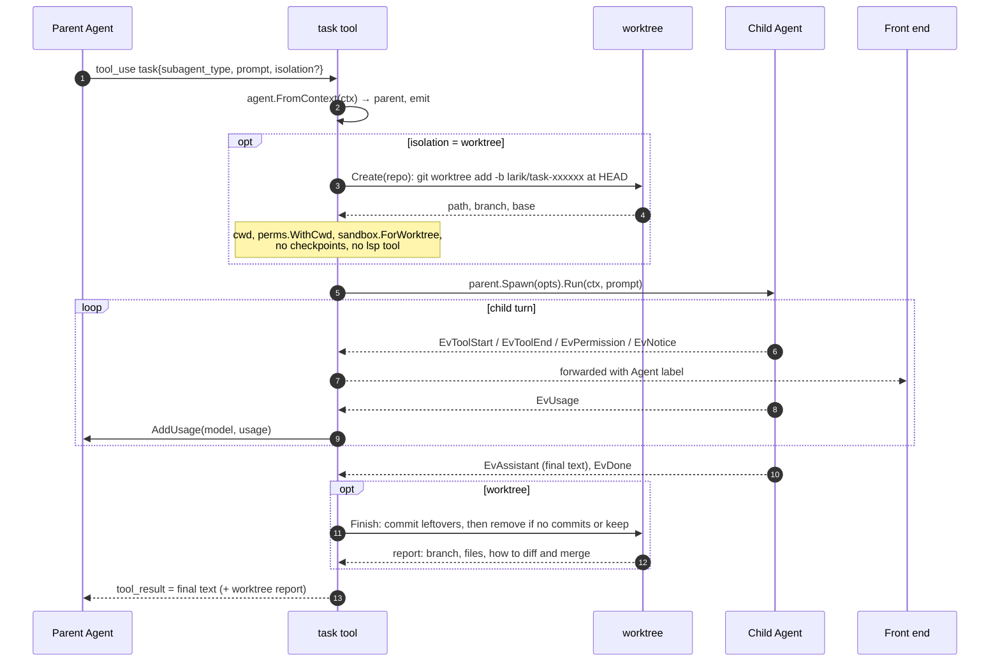
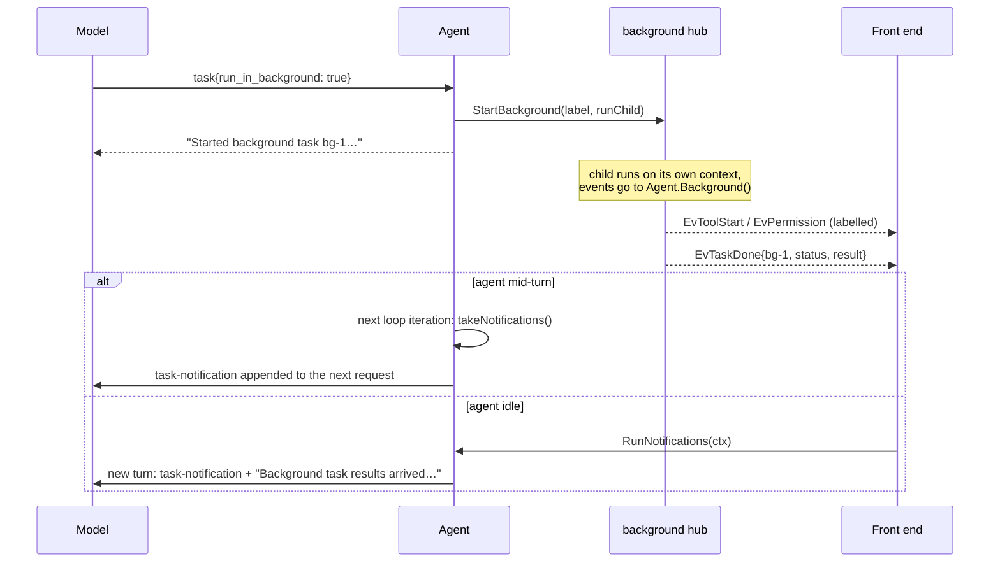
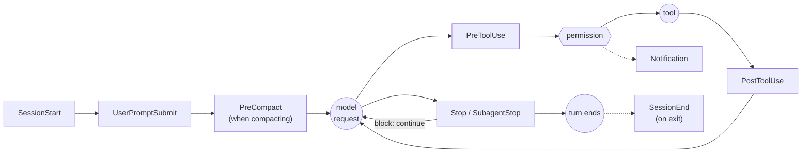

# Extensibility

Larik has six extension mechanisms. All of them plug into the same two seams: they either **add tools** to the registry, or **run at points in the loop**.

| Mechanism | Seam | Configured by | Package |
|---|---|---|---|
| Subagents | the `task` tool | `.larik/agents/*.md`, `.claude/agents/*.md` | [subagent](../internal/subagent), [worktree](../internal/worktree) |
| MCP servers | tools named `mcp__server__tool` | `mcp_servers`, `.mcp.json` | [mcp](../internal/mcp) |
| Skills | system-prompt index + the `skill` tool + `/name` expansion | `SKILL.md` folders | [skills](../internal/skills) |
| Hooks | lifecycle points in the loop | `hooks` in settings | [hooks](../internal/hooks) |
| Language servers | edit/write results + the `lsp` tool | `lsp` in settings, or on `PATH` | [lsp](../internal/lsp) |
| Web | `web_fetch`, `web_search` tools | env keys, `web` in settings | [web](../internal/web) |

## Subagents

The `task` tool ([task.go](../internal/subagent/task.go)) lets the model delegate. A subagent is a full `Agent`, created with `parent.Spawn` ([spawn.go:50](../internal/agent/spawn.go:50)).

**What the child gets:**

- A fresh context (it can't see the conversation, so the prompt must be self-contained).
- A system prompt: the definition's body + a footer asking for a complete final report + the shared env/instructions/skills context.
- The parent's tools filtered by the definition's `tools` list, minus `task`, `task_wait` and `task_stop` (no nesting).
- A model chosen by the task's `model` input, else the definition's `model`, else the parent's ([`Tool.model`](../internal/subagent/task.go)). Either can name a role (`worker`, `explore`, …) or a `provider/model`. The built-ins default to the `worker` and `explore` roles, and an unset role inherits. The task tool reads roles through `Tool.Roles` on every request, so `/routing` changes apply without a restart, and offers the `model` input only once some role has a model. Unmapped `opus`/`sonnet`/`haiku` aliases resolve only on Anthropic; elsewhere the child falls back to the parent's model with a notice.
- At most 100 model turns, or the role's `max_turns`. When the cap is hit, or the loop guard ([loop.go](../internal/agent/loop.go)) sees the same calls with the same results 4 times in 8 turns, the parent gets an error result telling it to check the child's changes, followed by the child's last message.
- Its own worktree when its role has `isolation: "worktree"` and neither the task nor the definition sets isolation. Only inside a git repository; elsewhere it works in place, with a notice.
- A smaller shared context when its role has `context: "minimal"`: `Tool.MinimalContextFunc` ([app.go](../internal/app/app.go)) in place of `ContextFunc`, built from `agent.MinimalContextSections` ([prompt.go](../internal/agent/prompt.go)) — the env block and this project's own `AGENTS.md`/`CLAUDE.md`, without the user's global instruction file or the skills index.

**What it shares with the parent:** the permission checker (same mode and rules), hooks (with `SubagentStop` instead of `Stop`), the checkpoint store, language servers and the sandbox. Its usage is added to the parent's totals, priced for the model that served each request (`UsageInfo.Model`). A transcript is saved under `<session>-agents/`. The parent's session budget covers it too: `checkBudget` ([budget.go](../internal/agent/budget.go)) walks up to the root agent, whose cost already includes every subagent's spend.

**What comes back:** only the child's final text message, truncated to the tool output cap. Tool calls and permission prompts are forwarded as events labelled `Agent: "explore: find auth"`, so the UI can nest them, but they never enter the parent's context.

`task` reports itself as read-only. The call itself changes nothing (every tool call inside the child is checked on its own), and read-only tools run in parallel, so several `task` calls in one response run as parallel subagents.

### Worktree isolation

With `isolation: "worktree"` (or `isolation: worktree` in the definition), the child works in its own checkout ([worktree.go](../internal/worktree/worktree.go)):

- Created under `~/.local/share/larik/worktrees/` from the current `HEAD`, on branch `larik/task-xxxxxx`. Uncommitted changes in your checkout are not included.
- The child's cwd, relative paths and path rules point into the worktree. Writes elsewhere ask for permission like any path outside cwd.
- The sandbox is re-derived with `ForWorktree`: writable are the worktree and the repo's shared `.git` (so commits work), while `.git/hooks`, `.git/config` and the other git files that choose which code git runs stay read-only.
- On finish, leftover changes are committed (with `--no-verify`, falling back to a Larik identity). No commits → worktree and branch are deleted. Otherwise both are kept and the result tells the parent how to review (`git diff base...branch`) and merge.
- Git operations on the shared repo are serialized with a per-repo lock, so parallel tasks can start and finish safely.

### Background tasks

With `run_in_background: true`, `task` calls `parent.StartBackground` ([background.go:78](../internal/agent/background.go:78)) and returns `bg-N` immediately. At most 8 run at once.

The model can also block with `task_wait` (all tasks or specific ids) or cancel with `task_stop`. Background tasks survive Esc on the foreground turn; `/tasks stop` or quitting stops them. In `-p` mode Larik exits only after every task has finished and been delivered.

### Definitions

Files are `<name>.md` with YAML frontmatter (`name`, `description`, `tools`, `model`, `isolation`) and a body that becomes the system prompt, the same format as Claude Code. Discovery ([defs.go](../internal/subagent/defs.go)), lowest to highest precedence: `~/.claude/agents`, `~/.config/larik/agents`, then `.claude/agents` and `.larik/agents` in each directory from the repo root down to cwd. Built-ins: `general-purpose` (all tools) and `explore` (read, grep, glob, lsp).

## MCP servers

[mcp.go](../internal/mcp/mcp.go) uses the official Go SDK over stdio, streamable HTTP or SSE.

- `NewManager(cfg).Start()` in `app.Setup` connects every enabled, approved server **in the background**, so startup isn't blocked.
- `Manager.Registry` is the agent's `LoadTools`: at the first prompt of a context it waits (bounded by the connect timeout) and returns built-in tools plus all connected servers' tools, sorted by name for a stable prompt prefix. Servers still starting, failed, or unapproved are reported as notices.
- Each server tool becomes a `tools.Tool` named `mcp__<server>__<tool>` (sanitized, de-duplicated). It is read-only only if the server declares `readOnlyHint: true` **and** `openWorldHint: false`: an open-world tool could leak data through its inputs.
- Text results pass through; images and binary resources are summarized.
- Project-scoped servers need `/mcp approve`, pinned to `MCPServer.Hash()`.

## Skills

[skills.go](../internal/skills/skills.go) implements [Agent Skills](https://agentskills.io) with **progressive disclosure**:

1. At startup, `Discover` scans the skill roots (user dirs, then `.agents/skills`, `.claude/skills`, `.larik/skills` from repo root to cwd; later overrides earlier).
2. Only `name: description` lines go into the system prompt (`Set.Index`). The index is rebuilt at each fresh context (`App.SystemPrompt` calls `Set.Reload`), so a new or edited skill is picked up after `/clear`.
3. When a task matches, the model calls the read-only `skill` tool to load the full body, then reads bundled files with normal tools.
4. The user can run a skill directly with `/name args`; `Set.Expand` replaces the prompt with the body (`$ARGUMENTS` substituted).

Frontmatter flags: `disable-model-invocation` removes a skill from the index; `user-invocable: false` hides it from `/`.

**Custom commands** (`commands/<name>.md` under `~/.claude`, the config dir, and `.claude` or `.larik` from repo root to cwd) are loaded into the same `Set` by `parseCommand`, with `Skill.Command` set. Their roots come first in `Roots`, so a skill overrides a command of the same name. Frontmatter is optional (the first body line stands in for a missing description); only commands with a `description` are model-invocable. `argument-hint` is read as a raw line, because Claude Code's `[a] [b]` style isn't valid YAML. When the user runs one, the agent replaces each `` !`cmd` `` with the bash tool's output, but only for commands `permission.Decide` allows without asking ([inline.go](../internal/agent/inline.go)); the rest are left out with a note. `allowed-tools` isn't honored, because a repository's file must not grant itself permissions.

## Hooks

[hooks.go](../internal/hooks/hooks.go) runs shell commands at lifecycle points, in Claude Code's format, so existing scripts work.

How a hook runs ([hooks.go:191](../internal/hooks/hooks.go:191)):

- Matchers are case-insensitive regexes over the target (tool name, or `startup`/`resume`/`clear`, or compaction trigger). All matching hooks for an event run **in parallel**; results are combined.
- Stdin is a JSON payload (`session_id`, `transcript_path`, `cwd`, `hook_event_name`, `tool_name`, `tool_input`, `tool_response`, `permission_mode`, …). `LARIK_PROJECT_DIR` and `CLAUDE_PROJECT_DIR` are set. Each hook has its own process group and a timeout (60 s default).
- **Exit 0**: success; stdout may be JSON with `decision`, `reason`, `continue: false` + `stopReason`, `systemMessage`, or `hookSpecificOutput` (`permissionDecision`, `updatedInput`, `additionalContext`).
- **Exit 2**: block; stderr is the reason and goes to the model (for `PreToolUse` it's a deny).
- **Other codes**: non-blocking error shown to the user.

Inside the agent ([agent/hooks.go](../internal/agent/hooks.go)), hook output enters the conversation wrapped in `<hook-context source="…">` or `<hook-feedback source="…">` tags, so the model can tell it apart from the user.

## Language servers

[lsp/manager.go](../internal/lsp/manager.go) starts built-in servers (gopls, typescript-language-server, pyright, rust-analyzer, clangd) when their binary is on `PATH`, lazily on the first matching file, once per project root.

The key integration is in `tools.Env`: after `edit`, `multi_edit` or `write` succeeds, `Env.Diagnostics` syncs the file to its server and waits (up to 3 s; 15 s while the server is loading) for fresh diagnostics, then appends new errors and warnings to the tool result. The model sees `ERROR 5:19 undefined: gret` in the same response that confirmed its edit, without running a build. `read` calls `Env.Touch` to warm up the server in the background.

The read-only `lsp` tool offers definition, references, hover, symbols, workspace symbols and diagnostics.

## Web

`web_fetch` ([fetch.go](../internal/web/fetch.go)) converts HTML to Markdown (stripping scripts, nav, headers, footers), resolves links, pages long content with `start`/`max_length`, and caches for 15 minutes. `web_search` picks a backend (Brave, Tavily, SearXNG) from personal config or environment keys. Both ask before running; see [security](security.md#web-tools) for the network protections.
