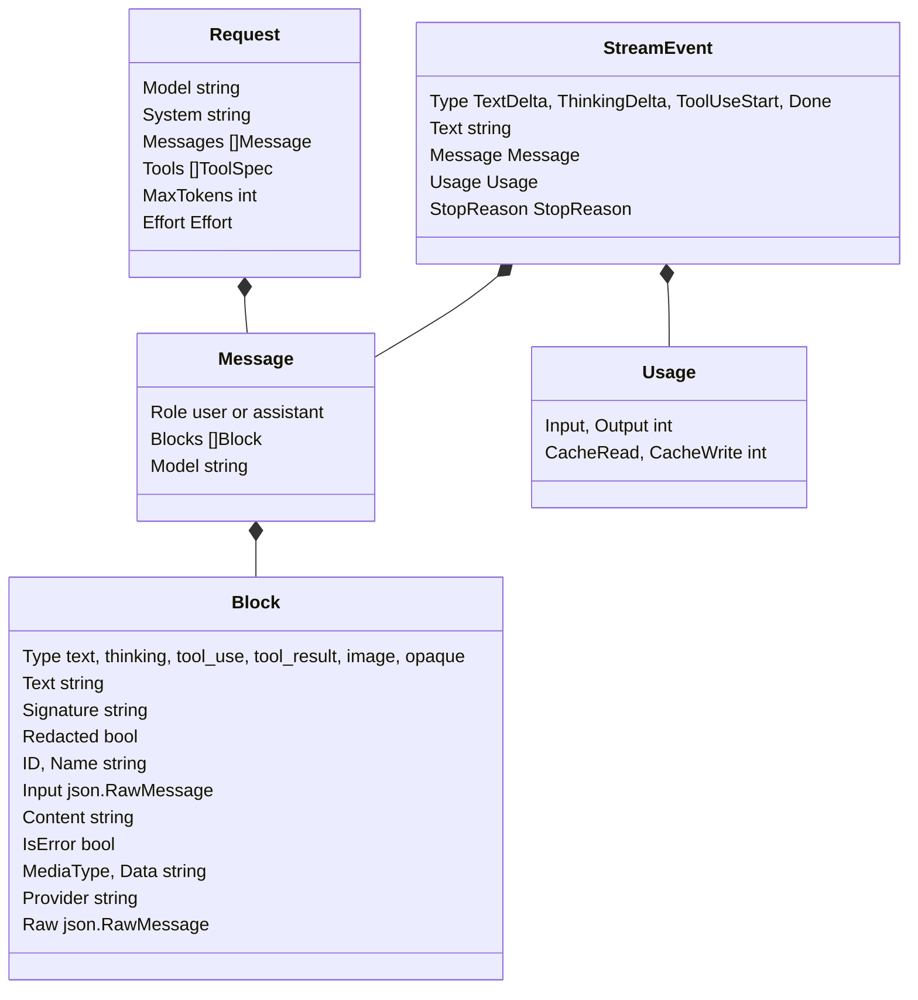
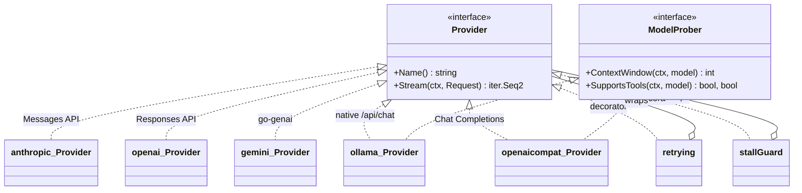
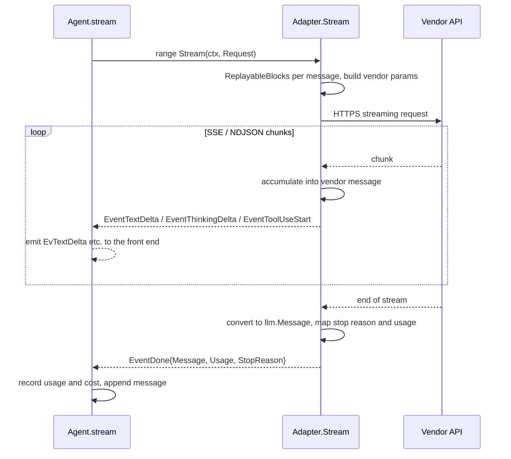
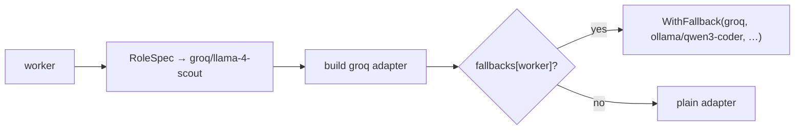

# Providers

Larik talks to many model APIs through one small interface. The agent loop only ever sees `llm` types; each adapter translates them to and from its vendor's wire format.

## The neutral model

[internal/llm/types.go](../internal/llm/types.go) defines the conversation. No vendor SDK is imported there.



Design choices worth knowing:

- **`Block` is a flat union.** One struct with optional fields instead of an interface per kind, so a message round-trips through JSONL with the standard encoder and no custom codecs.
- **Only two roles.** Tool results are blocks inside a user message, as in the Anthropic API. Adapters for APIs with a separate `tool` role split them out.
- **Tool results can carry images** (`Block.Images`, from `tools.Result.Images`), such as `browser_screenshot`'s capture or an MCP tool's image. Each adapter sends them where its API allows:

  | Adapter | Where the images go |
  |---|---|
  | anthropic | Inside the `tool_result` content |
  | openai | Inside `function_call_output` as `input_image` items |
  | gemini | As inline-data parts right after the function response (`FunctionResponse.Parts` needs Gemini 3) |
  | openaicompat, ollama | In the user message after the tool messages (whose content can only be text), introduced by `llm.ToolImagesNote` |

  A model that can't read images rejects them, as it would an `@image` mention.
- **`Message.Model` and `Block.Provider` record who produced a block.** That's what makes provider switching safe (see below).
- **`Signature` and `Raw`** carry vendor data the other side needs back: Anthropic thinking signatures, Gemini thought signatures, OpenAI encrypted reasoning items (as `BlockOpaque` with the item in `Raw`).
- **`Effort`** (`low` … `max`, empty for the provider default) is mapped per adapter: adaptive thinking effort for Anthropic, `reasoning.effort` for OpenAI, a thinking level for Gemini, a fixed thinking budget for older Claude models, `think` for Ollama.

## The Provider interface

```go
type Provider interface {
    Name() string
    Stream(ctx context.Context, req Request) iter.Seq2[StreamEvent, error]
}
```

`Stream` returns a Go 1.23 range-over-func iterator. The adapter yields display deltas while the response streams, then exactly one `EventDone` with the fully assembled `Message`, the `Usage` and a `StopReason`. **Deltas are for the screen; `EventDone` is the source of truth** for the transcript. Adapters never have to reconstruct a message from their own deltas consistently with the UI: they use their SDK's accumulator.

Errors are yielded as the second value. Adapters convert vendor errors into `*llm.APIError{Status, Retryable, RetryAfter}` (via `ClassifyStatus`) and wrap `llm.ErrContextOverflow` when the prompt is too long, so the loop can compact and retry without knowing any vendor's error codes.

Optional capability: `ModelProber` ([provider.go](../internal/llm/provider.go)) lets a local server report the context window it actually loaded and whether a model supports tools. The agent uses it to size compaction and to warn about truncation or tool-less models ([probe.go](../internal/agent/probe.go)).



## The adapters

### Claude Code CLI runtime

`claude-code-cli/<model>` uses the installed `claude` executable as a whole-turn runtime. It checks the CLI's supported flags and first-party subscription sign-in, starts an isolated process with stream-json input/output, and serves Larik tools through a short-lived authenticated loopback MCP bridge. Isolation uses `--restricted` (no user, project or local settings files, hence none of the user's hooks or plugins; `--mcp-config` servers still load) and falls back to `--safe-mode` on CLIs without it. Current releases' `--safe-mode` turns off every MCP server, the bridge included, which leaves the model without tools. Tools that may run together (read-only or concurrency-safe) are marked `readOnlyHint` on the bridge, which is what lets Claude Code issue them concurrently; the agent then runs them in parallel as `runTools` would: permission checks one at a time in arrival order, and a call that writes runs alone. Tool calls still return to Larik for permission decisions, hooks, execution, and transcript recording. Authentication remains owned by Claude Code; the inference child does not receive Anthropic API-key or cloud-provider routing variables. Claude Code has no supported non-interactive command to enumerate account-available models. Larik offers its rolling `sonnet`, `opus`, and `fable` aliases, plus the CLI's supported effort levels; enter a full model ID if needed. Claude Code validates the selection when a turn starts. Context compaction is managed by Claude Code; Larik's `/compact` command is unavailable for this runtime. Use `anthropic/<model>` for the API-key Messages API adapter.

| Adapter | API | What it handles |
|---|---|---|
| [anthropic](../internal/llm/anthropic/anthropic.go) | Messages API (official SDK) | Adaptive thinking with summarized display and `effort`; fixed budgets for older models. Prompt caching: a breakpoint on the system prompt, one where the previous request ended (the last block of the user message before the newest assistant message, so a turn with many parallel tool calls still hits the cache past the API's ~20-block lookback), plus automatic placement on the last cacheable block. Converted tool schemas are cached. Eager tool-input streaming, with detection of truncated JSON. If thinking blocks are rejected because their prefix changed (e.g. resumed with different tools), it strips thinking and retries once. |
| [openai](../internal/llm/openai/openai.go) | Responses API (official SDK) | Stateless: `store: false` and `include: reasoning.encrypted_content`, so reasoning items come back encrypted, are kept as opaque blocks, and are replayed on the next request. No server-side conversation state. Each request carries the conversation's cache key (`llm.Request.CacheKey`, a UUID derived from the session ID) as `prompt_cache_key`; the ChatGPT backend ignores that field and reads the key from the `session_id`/`conversation_id` headers, which `NewChatGPT` sends too. Without them it assigns every request a fresh key, so nothing is ever read from cache. Also serves ChatGPT-plan Codex models (`NewChatGPT`) with an OAuth token source from [internal/chatgpt](../internal/chatgpt/chatgpt.go). |
| [gemini](../internal/llm/gemini/gemini.go) | Google Gen AI SDK | Thought signatures on function calls and text are preserved and returned; thought summaries are marked display-only. Synthesizes call IDs when Gemini omits them. Wrapped in `llm.WithRetry`. |
| [ollama](../internal/llm/ollama/ollama.go) | Native `/api/chat` | Sends `num_ctx` per request (32768 by default, capped at the model's maximum), because Ollama's OpenAI-compatible endpoint ignores the requested window and loads 4096 tokens. Reports the real window and tool support. |
| [openaicompat](../internal/llm/openaicompat/compat.go) | Chat Completions | Any compatible server. Presets for NVIDIA NIM, OpenRouter, Groq, DeepSeek, xAI, Mistral, Together, Ollama and LM Studio. Reads reasoning deltas where servers send them. |

All adapters are tested against canned SSE served by [internal/llm/llmtest](../internal/llm/llmtest/llmtest.go), so the tests need no API keys.

## A streaming request



## Switching providers mid-conversation

`/model` can switch from, say, Claude to GPT to a local Qwen in the same session. The problem: thinking blocks and reasoning items are only valid for the model that produced them. Anthropic rejects foreign or modified thinking; OpenAI's encrypted reasoning is meaningless to anyone else.

`llm.ReplayableBlocks(m, provider, model)` ([retry.go](../internal/llm/retry.go)) solves this at request-build time. Thinking and opaque blocks are sent only when both the message's `Model` and the block's `Provider` match the target. Everything else (text, tool calls, tool results, images) is portable. The stored transcript keeps everything, so switching back to the original model replays its own reasoning again.

Gemini uses `Provider: "gemini-display"` for thought summaries so they are never replayed even to Gemini, while signatures riding on text and function-call parts are.

## Resolving "provider/model"

`providers.Resolve` ([providers.go](../internal/providers/providers.go)) turns a spec into a `Provider` and a model id:

1. Empty spec → config `model` → the first provider with an API key in the environment (Anthropic, then OpenAI, then Gemini).
2. `head/rest` where `head` is a configured or built-in provider → that provider and `rest` (so `openrouter/anthropic/claude-sonnet-5` works).
3. A bare id → the catalog's provider, or a naming convention (`claude-*`, `gemini-*`, `gpt-*`, `o3*`, `*codex*`).
4. `build` constructs the adapter, reading the key from config (`api_key`, `api_key_env`) or the preset's environment variable. Custom endpoints use `"type": "openai-compatible"`.

`nvidia-nim` uses `https://integrate.api.nvidia.com/v1` and `NVIDIA_API_KEY` for NVIDIA's hosted catalog. [Developer access](https://docs.api.nvidia.com/nim/docs/product) is for prototyping, research, development, and testing. A self-hosted NIM endpoint can use a custom OpenAI-compatible provider.

## Roles and fallbacks

`Resolve` also accepts a **role** name ([routing.go](../internal/providers/routing.go)):
- `RoleSpec` maps it through the `roles` config.
- The built-in roles `smart`, `worker`, `explore` and `compact` always exist. An unset role resolves to the main model.
- `opus`/`sonnet`/`haiku` act as roles that default to the Claude models.
- A role must name a `provider/model`, never another role.

Config reads go through `Config.Routing()`, a snapshot taken under a lock, because `/routing` can save new roles while subagents resolve on other goroutines.

After resolving, `withFallbacks` looks up `fallbacks[role]`, else `fallbacks[spec]`, and wraps the provider in `llm.WithFallback` ([fallback.go](../internal/llm/fallback.go)). Candidates that can't be built (no key, say) are skipped.

The decorator follows the same rule as `WithRetry`: it only switches while nothing has been yielded.
- **What triggers a switch:** `ShouldFallBack` accepts rate limits, quota and auth failures (401/402/403/404/408/429) and server errors.
- **What doesn't:** it rejects `ErrContextOverflow` and bad requests, which would fail anywhere.
- **The switch itself:** it rewrites `req.Model` for the candidate and yields an `EventNotice`, which the agent shows as a notice.
- **Cooldown:** a failed candidate is then skipped without a notice, for 1 minute after a rate limit or server error and for 10 minutes otherwise. The last candidate is always tried. The cooldown table is process-wide, keyed by `provider/model`, because each subagent task resolves its own chain.

Adapters stamp the final message with `req.Model`, so two things follow automatically:
- Usage and cost are attributed to the model that actually answered.
- `ReplayableBlocks` treats that model's reasoning as its own.

The wrapper also implements `ModelProber` by delegating to the candidate serving the model, so local-server window probing keeps working.



## Benchmarking a routing choice

[internal/bench](../internal/bench) and `larik bench` run a handful of small, self-checking coding tasks (a failing test to fix, a stub to implement, a rename across two files) against one or more models, so a role's model can be judged by outcome instead of price and name alone. Each `bench.Task` sets up its own throwaway directory and checks the result by running `go test`, so there is no LLM-as-judge and no extra API cost for grading. `bench.Run` builds a plain `Agent` in `permission.ModeYolo` (the directory is discarded afterwards, so there is nothing to protect) and reports pass/fail, cost and wall time.

`SuggestRouting` fills the `/routing` presets.
- **Ranking:** models are ranked by `cheapness`. Local models come first, then ChatGPT-plan models, then the catalog list price weighted towards input. Unpriced models are placed by a guess from their name.
- **Excluded:** tool-less models are skipped, and local models under 7B are never picked as `worker`.

## The model catalog

[catalog.go](../internal/llm/catalog.go) lists known models with context window, max output and prices. It drives the context percentage, the compaction threshold and cost reporting. Unknown models get a 128k window and no price. The `models` config key adds or overrides entries.
