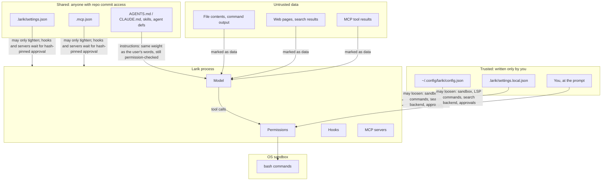

# Security model

A coding agent runs commands chosen by a model that reads untrusted text (repository files, web pages, tool output, MCP results). Larik's defences are layered so that no single one has to be perfect.

## Threats and the layer that handles each

| Threat | Main defence | Backup |
|---|---|---|
| Model runs a destructive or exfiltrating command | OS sandbox: writes confined, network off | Permission prompt for anything unsandboxed; deny rules |
| Prompt injection in files or web pages | System prompt marks tool output as data; web content marked untrusted | Every side effect still goes through permissions and the sandbox |
| A cloned repo ships malicious config | Shared config can only tighten; hooks and MCP servers need approval pinned to a hash | Sandbox keeps `.larik/`, `.claude/`, `.mcp.json`, `.git/hooks`, `.git/config` read-only |
| Sandboxed command plants code that runs later outside the sandbox | Protected paths inside the project stay read-only | — |
| Model overwrites a file it never saw, or one you changed | Read-before-write freshness check | `/undo` checkpoints |
| `web_fetch` used for SSRF (cloud metadata, redirects) | Resolved-IP blocklist; cross-host redirects reported, not followed | Per-domain permission |
| A web page or other local process drives `larik serve` | Bearer token, loopback-only listener, Host header check | `--allow-remote` must be explicit |
| Parallel subagents clobber each other or your work | Worktree isolation on separate branches | Nothing merges without review |

## Trust boundaries

Instruction files, skills and agent definitions are treated as instructions, like in other harnesses: a repository you don't trust can still steer the model. What it can't do is give the model new powers. Everything the model asks for still passes through the permission checker, and bash still runs in the sandbox.

## The OS sandbox

[internal/sandbox/sandbox.go](../internal/sandbox/sandbox.go) wraps each `bash` command:

- **macOS:** `sandbox-exec -p <profile> bash -c <cmd>` with a generated Seatbelt profile (`deny default`, then specific allows).
- **Linux:** `bwrap` with `/` bound read-only, writable paths bound read-write, protected paths re-bound read-only, `--unshare-net` and `--unshare-pid`.
- **Elsewhere, or without `bwrap`:** no sandbox; every command asks, and Larik says so at startup.

| | Allowed | Denied |
|---|---|---|
| Read | everything | — |
| Write | project root (git root), `/tmp`, `$TMPDIR`, build caches (Go, npm, Cargo, `~/.cache`, `~/Library/Caches`), personal `writable` paths | everything else, and `.git/hooks`, `.git/config`, `.larik`, `.claude`, `.mcp.json` inside the project |
| Network | localhost (bind and connect) | everything else, unless personal config sets `network: true` |
| macOS services | a short list of system lookups CLI tools need | LaunchServices and Apple Events, so `open` and `osascript` can't launch something outside |

The protected paths matter because the project itself is writable. Without them, a sandboxed command could add a git hook, a hook in `.larik/settings.json`, or an MCP server in `.mcp.json`, and that code would later run **outside** the sandbox. In Seatbelt the deny rules are emitted after the allow rules, because later rules win.

**How it removes prompts.** The sandbox is what makes the default mode usable: `permission.Decide` allows sandboxed bash without asking ([permission.go:161](../internal/permission/permission.go:161)). If a command needs more (install packages, reach the network), the model re-runs it with `"sandbox": false`, and that call asks, with the prompt saying it runs unconfined. When a sandboxed command fails with typical sandbox errors ("Operation not permitted", DNS failures), the bash tool appends a hint telling the model exactly that ([bash.go](../internal/tools/bash.go)).

Worktree subagents get a derived sandbox (`ForWorktree`) where the worktree replaces the project and the shared `.git` is writable but its hooks and config aren't.

## Web tools

- `web_fetch` resolves DNS itself and refuses to connect if any resolved address is link-local (including `169.254.169.254`), multicast, unspecified, or a known cloud metadata address. Checking the resolved IP defeats DNS tricks. Loopback and private ranges stay reachable for local dev servers; the call still asks.
- Redirects to a different host are **reported to the model, not followed**, so a redirect can't sidestep a `web_fetch(domain:…)` rule.
- Responses are capped at 5 MB and 30 s.
- The search backend receives every query, so it is honored only from personal files. A shared file can only disable web tools.
- Plan mode asks for web tools instead of denying them.

## Server mode

[internal/server/server.go](../internal/server/server.go):

- Listens on loopback only, unless `--allow-remote`.
- Every request except `GET /v1/health` needs `Authorization: Bearer <token>`, compared in constant time. The event stream also accepts `?token=` because browser `EventSource` can't set headers.
- `checkHost` rejects requests whose `Host` isn't `localhost` or a loopback IP. This blocks DNS rebinding, where a web page resolves its own domain to `127.0.0.1` to reach local services.
- Permission requests still need an answer. A client can't make a run skip them.

## Credentials

- API keys come from the environment or `api_key_env`; `api_key` in a config file is supported but not required.
- ChatGPT (Codex) sign-in is stored in `~/.config/larik/chatgpt-auth.json` with owner-only permissions, refreshed before expiry, and separate from the Codex CLI's login.
- Session files and checkpoints are created `0600` in `0700` directories.
