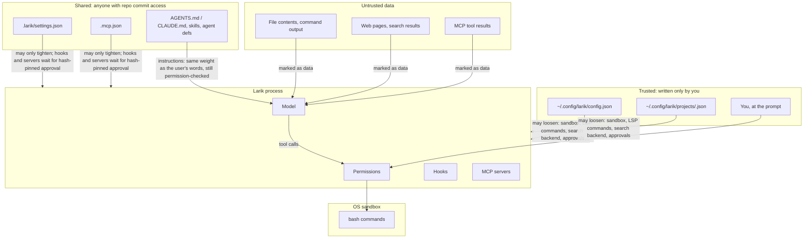

# Security model

A coding agent runs commands chosen by a model that reads untrusted text (repository files, web pages, tool output, MCP results). Larik's defences are layered so that no single one has to be perfect.

## Threats and the layer that handles each

| Threat | Main defence | Backup |
|---|---|---|
| Model runs a destructive or exfiltrating command | OS sandbox: writes confined, network off | Permission prompt for anything unsandboxed; deny rules |
| Prompt injection in files or web pages | System prompt marks tool output as data; web content marked untrusted | Every side effect still goes through permissions and the sandbox |
| A cloned repo ships malicious config | Shared config can only tighten; hooks and MCP servers need approval pinned to a hash | Sandbox keeps `.larik/`, `.claude/`, `.mcp.json`, `.git/hooks`, `.git/config` (and `commondir`, `modules/`, `worktrees/`, …) read-only; `.git` can't be moved |
| Sandboxed command plants code that runs later outside the sandbox | Protected paths inside the project stay read-only | — |
| Model overwrites a file it never saw, or one you changed | Read-before-write freshness check | `/undo` checkpoints |
| `web_fetch` used for SSRF (cloud metadata, redirects) | Resolved-IP blocklist; cross-host redirects reported, not followed | Per-domain permission |
| A web page or other local process drives `larik serve` | Bearer token, loopback-only listener, Host header check | `--allow-remote` must be explicit |
| Parallel subagents clobber each other or your work | Worktree isolation on separate branches | Nothing merges without review |

## Trust boundaries

Instruction files, skills and agent definitions are treated as instructions, like in other harnesses: a repository you don't trust can still steer the model. What it can't do is give the model new powers. Everything the model asks for still passes through the permission checker, and bash still runs in the sandbox.

## The OS sandbox

[internal/sandbox/sandbox.go](../internal/sandbox/sandbox.go) wraps each `bash` command:

- **macOS:** `sandbox-exec -p <profile> bash -c <cmd>` with a generated Seatbelt profile (`deny default`, then specific allows).
- **Linux:** `bwrap` with `/` bound read-only, writable paths bound read-write, protected paths re-bound read-only, `--unshare-net` and `--unshare-pid`.
- **Elsewhere, or without `bwrap`:** no sandbox; commands ask except a small list of side-effect-free forms, and Larik warns at startup.

| | Allowed | Denied |
|---|---|---|
| Read | everything | — |
| Write | project root (git root), the sandbox's own private temp directory, build caches (Go, npm, Cargo, `~/.cache`, on macOS also `~/Library/Caches` and the per-user temp root), personal `writable` paths | everything else -- notably the literal `/tmp`, and inside the project `.larik`, `.claude`, `.mcp.json` and the git dir entries `hooks`, `config`, `config.worktree`, `commondir`, `info`, `modules`, `worktrees` (`.git` itself can't be moved or replaced) |
| Network | localhost (bind and connect) | everything else, unless personal config sets `network: true` |
| macOS services | a short list of system lookups CLI tools need | LaunchServices and Apple Events, so `open` and `osascript` can't launch something outside |

The protected paths matter because the project itself is writable. Without them, a sandboxed command could add a git hook, a hook in `.larik/settings.json`, or an MCP server in `.mcp.json`, and that code would later run **outside** the sandbox. In Seatbelt the deny rules are emitted after the allow rules, because later rules win.

The git entries are there because git trusts its directory completely: `commondir`, a per-worktree `config.worktree`, or a `.git` file saying `gitdir: <elsewhere>` would each point git at a config or hooks the command wrote somewhere writable, and `core.fsmonitor` or `core.hooksPath` there runs on the next `git status` outside the sandbox. Objects, refs and the index stay writable, so sandboxed commits work. `.git` itself is pinned in place: Seatbelt denies writes to that exact path, and bubblewrap binds it onto itself, since a mount point can't be renamed or removed. On Linux, bubblewrap can only re-bind paths that exist, so a protected path that doesn't exist yet (for example `.git` in a project that isn't a repository) isn't enforced there.

**Known gap: build caches.** The writable build caches (`~/go/pkg/mod`, `GOCACHE`, `~/.cargo/registry`, `~/.npm`, `~/.cache`) are shared with builds you run outside the sandbox. A sandboxed command can change a cached dependency's source (a Cargo `build.rs`, a Go module) or a tool environment kept under `~/.cache` (such as pre-commit's), and that code runs the next time an unsandboxed build uses it. They are writable because builds inside the sandbox need them. After letting the agent work on code you don't trust, clear those caches before building outside the sandbox.

The `write`, `edit` and `multi_edit` tools enforce the project boundary separately with `os.Root`. They reject protected paths and symlink components, and a failed checkpoint stops the write.

**How it removes prompts.** The sandbox is what makes the default mode usable: `permission.Decide` allows sandboxed bash without asking ([permission.go:161](../internal/permission/permission.go:161)). If a command needs more (install packages, reach the network), the model re-runs it with `"sandbox": false`, and that call asks, with the prompt saying it runs unconfined. When a sandboxed command fails with typical sandbox errors ("Operation not permitted", DNS failures), the bash tool appends a hint telling the model exactly that ([bash.go](../internal/tools/bash.go)).

Worktree subagents get a derived sandbox (`ForWorktree`) where the worktree replaces the project and the shared `.git` is writable but its hooks and config aren't. They share the parent's private temp directory rather than getting their own.

**The literal `/tmp` is never writable.** Earlier, `defaultWritable` granted write access to `/tmp` and `os.TempDir()` outright, on the theory that scripts need somewhere to put scratch files. In testing, a subagent running a small local model executed `cd /tmp && rm -rf <name>` as a "clean up after myself" step and deleted another program's files that happened to live under `/tmp` -- on most systems that directory is shared by every program any user on the machine runs, not scoped to the project or even to Larik. Each `Sandbox` now creates its own private directory (`New`'s `tmpDir`, removed by `Close`) and exposes it to sandboxed commands as `$TMPDIR`/`$TMP`/`$TEMP` ([sandbox.go](../internal/sandbox/sandbox.go)), so `mktemp`, `go build`, `npm` and friends still have somewhere safe to write, without exposing the shared system directory. On macOS, `os.TempDir()` (the per-user temp root under `/var/folders/...`) stays writable as before: it's scoped to one OS user rather than the whole machine, and several macOS tools -- notably bare `mktemp` with no template -- resolve to it via `confstr(_CS_DARWIN_USER_TEMP_DIR)` regardless of `$TMPDIR`.

## Web tools

- `web_fetch` resolves DNS itself and refuses to connect if any resolved address is link-local (including `169.254.169.254`), multicast, unspecified, or a known cloud metadata address. Checking the resolved IP defeats DNS tricks. Loopback and private ranges stay reachable for local dev servers; the call still asks.
- Redirects to a different host are **reported to the model, not followed**, so a redirect can't sidestep a `web_fetch(domain:…)` rule.
- Responses are capped at 5 MB and 30 s.
- The search backend receives every query, so it is honored only from personal files. A shared file can only disable web tools.
- Plan mode asks for web tools instead of denying them.
- `browser_navigate` applies the same address check before opening a URL, and only opens http(s). The check covers the URL the model asks for; Chrome follows redirects and loads subresources itself, so it is weaker than `web_fetch`'s. The browser is off unless a personal file enables it, and its profile keeps sign-ins, so treat allowing `browser_*` tools like handing over that Chrome profile. Plan mode allows only opening pages (after asking) and reading them.

## Server mode

[internal/server/server.go](../internal/server/server.go):

- Listens on loopback only, unless `--allow-remote`.
- Every request except `GET /v1/health` needs `Authorization: Bearer <token>`, compared in constant time. The event stream also accepts `?token=` because browser `EventSource` can't set headers.
- `checkHost` rejects requests whose `Host` isn't `localhost` or a loopback IP. This blocks DNS rebinding, where a web page resolves its own domain to `127.0.0.1` to reach local services.
- Permission requests still need an answer. A client can't make a run skip them.

## Credentials

- API keys come from the environment or `api_key_env`; `api_key` in a config file is supported but not required.
- ChatGPT (Codex) sign-in is stored in `~/.config/larik/chatgpt-auth.json` with owner-only permissions, refreshed before expiry, and separate from the Codex CLI's login.
- MCP server sign-ins (`/mcp login`) are stored per server and URL in `~/.config/larik/mcp-auth/`, owner-only. A server never opens a browser on its own: sign-in runs only when you ask, and a server from a shared project file must be approved first.
- Session files and checkpoints are created `0600` in `0700` directories.
- Debug traces (`--debug`, `/debug on`) are written the same way. They redact credential headers and URL keys but keep prompts, file contents and tool output, and the raw HTTP request bodies. Only personal settings can turn recording on. `larik trace` serves a trace on `127.0.0.1` only, behind a random token in the URL, and refuses requests whose `Host` isn't the loopback address.
