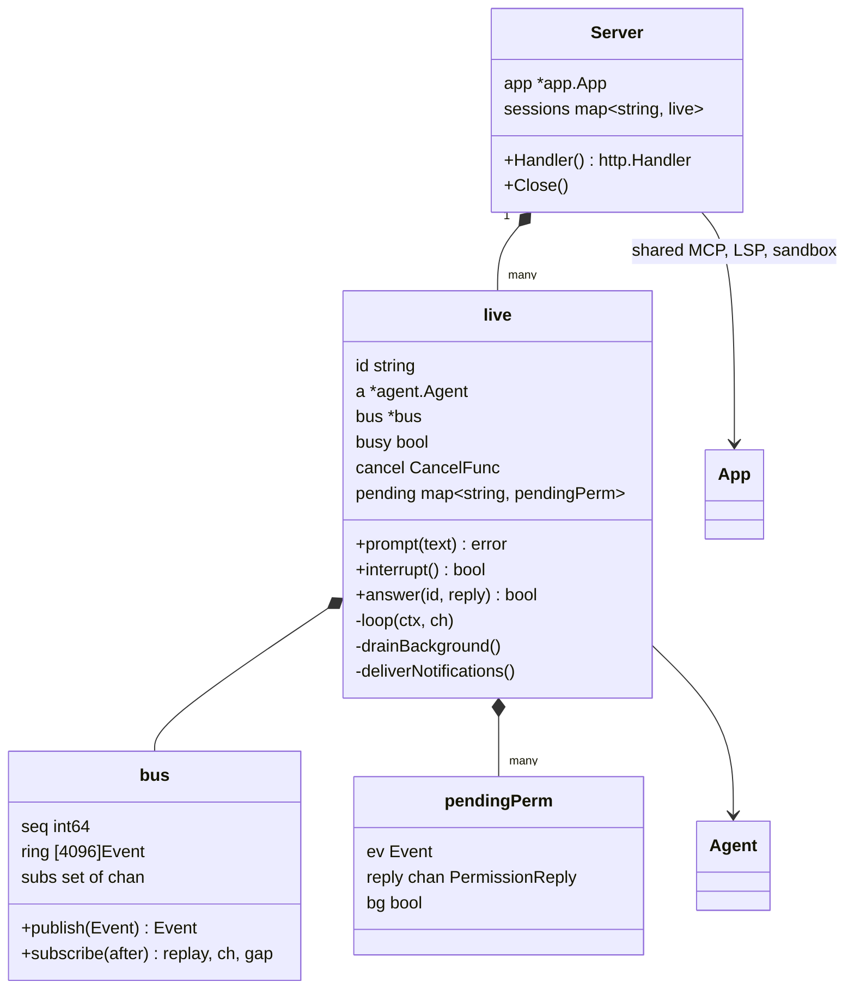
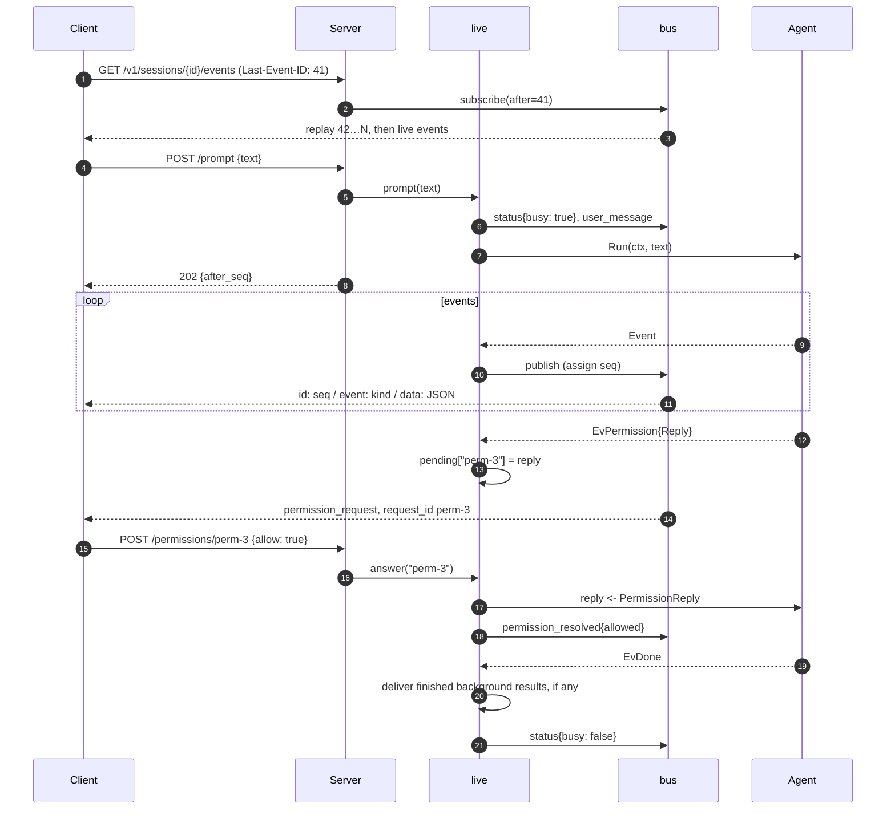

# Server mode

`larik serve` exposes the agent over a local HTTP API with one Server-Sent Events stream per session. The endpoint reference is in the [README](../README.md#server-mode); this page explains the internals.

## Structure

- One `app.App` per server, so all sessions share MCP connections, language servers and the sandbox.
- One `live` per loaded session ([live.go](../internal/server/live.go)). It owns the `Agent`, a busy flag, the cancel function of the current run, and the permission requests waiting for an answer.
- One `bus` per session ([bus.go](../internal/server/bus.go)): a ring buffer of the last 4096 events with increasing sequence numbers, and a set of subscriber channels.

## A prompt, end to end

With `{"wait": true}`, the handler subscribes before starting the run, reads events itself, and returns the final answer in the HTTP response.

## Design points

**Events are the agent's own.** The SSE `data` is the `agent.Event` JSON (the same schema as `-p --output json`) plus `seq`, `session`, and `request_id` for permission requests. The server adds four kinds: `status`, `user_message`, `permission_resolved`, `session_closed`.

**Reconnects replay.** A client reconnecting with `Last-Event-ID` (or `?after=`) gets every retained event after that sequence, then live ones. If the gap is older than the ring, the stream starts with a `: gap` comment telling the client to refetch `/messages`. Without either header, a stream starts with new events only.

**Slow clients don't slow the agent.** Each subscriber has a 1024-event buffer. `publish` never blocks: a subscriber that falls behind is disconnected and can reconnect and replay. Writes coalesce whatever is queued into one flush, and a keepalive comment goes out every 15 s.

**Permission requests outlive the HTTP request.** A pending request holds the agent's reply channel until any client answers. When a run ends, its unanswered requests expire (`permission_resolved: expired`). Requests from background tasks survive until the tasks end.

**Idle sessions still deliver background results.** `drainBackground` reads `Agent.Background()` for the session's whole life. When a task finishes and the session is idle, `deliverNotifications` starts a turn by itself with `RunNotifications`, and `loop` keeps going until no undelivered results remain, so the model always sees them.

**One run at a time.** `prompt`, `compact`, `undo` and `clear` all mark the session busy; a second one returns 409. `cancel` cancels the current run's context.

## Security

See [security: server mode](security.md#server-mode): bearer token (constant-time compare), loopback-only listener, Host header check against DNS rebinding, and `--allow-remote` to lift both.
