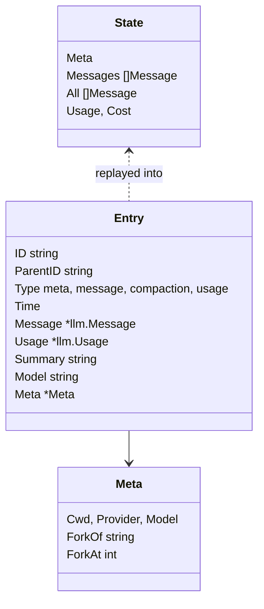
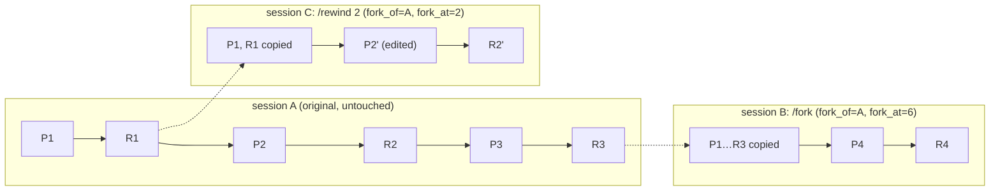
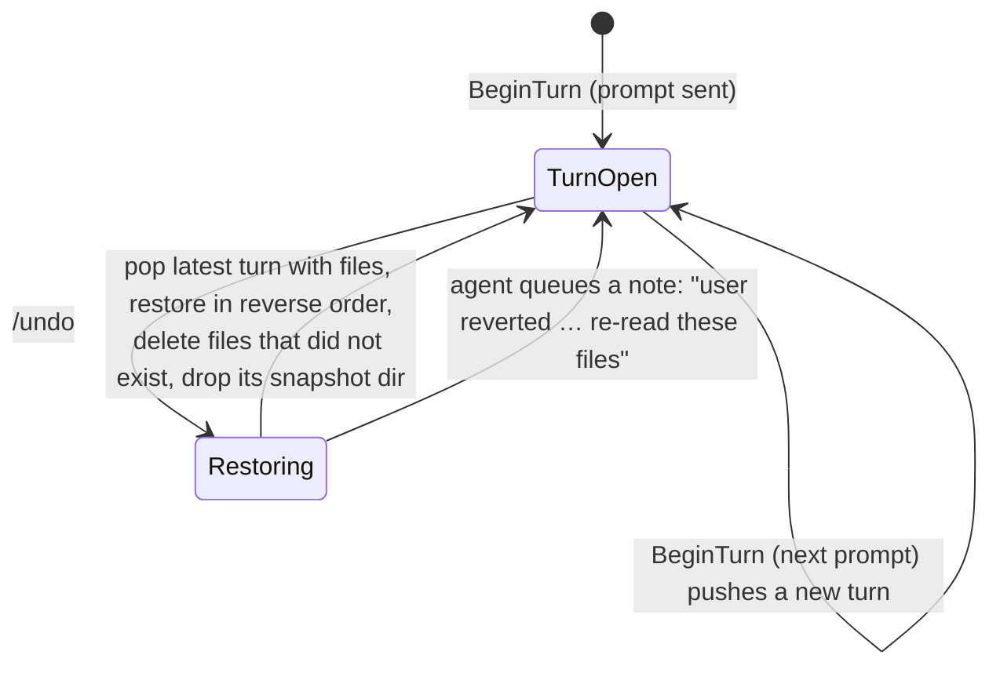
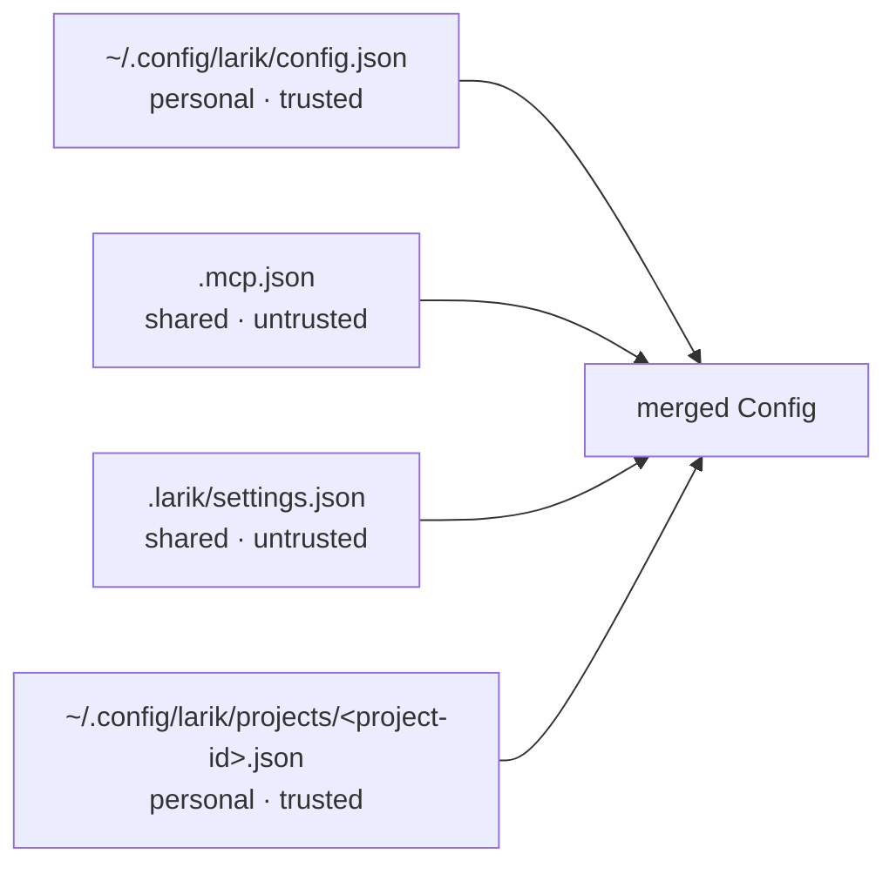

# State and persistence

Larik keeps four kinds of state on disk. All of it is under `~/.local/share/larik` (or `$XDG_DATA_HOME/larik`), except config.

```
~/.local/share/larik/
├── sessions/<cwd-slug>/
│   ├── 20260927-101500-a1b2c3.jsonl          one session (or branch)
│   ├── 20260927-101500-a1b2c3-agents/        subagent transcripts for that session
│   │   └── 20260927-101733-d4e5f6.jsonl
│   └── 20260927-101500-a1b2c3.trace/         debug mode only: events.jsonl + http/ bodies
├── checkpoints/<session-id>/<turn>/
│   ├── manifest.json                         which files, whether they existed, mode
│   └── 0.bin, 1.bin, …                       original bytes
├── worktrees/<repo>/task-xxxxxx/             isolated subagent checkouts
└── logs/                                     mcp-<name>.log, lsp-<name>.log
```

## Sessions: append-only JSONL

[internal/session/session.go](../internal/session/session.go). One file per session, one JSON object per line. Nothing is ever rewritten.



| Entry type | Written when | Effect on replay |
|---|---|---|
| `meta` | Session created (first line) | Cwd, provider/model, fork origin |
| `message` | Every user or assistant message, with usage on assistant messages | Appended to both `Messages` (the context) and `All` (display history) |
| `compaction` | After a successful compaction | `Messages` is reset to the single summary message, which names this file so the model can grep it; `All` keeps everything |
| `usage` | Spend made on this session's behalf outside its transcript (subagents) | Added to usage and cost |

Every entry has an `id` and the `parent_id` of the previous entry, so the file is also a linked list. `read` tolerates a torn last line after a crash.

**Why append-only?** Three reasons: a crash can't corrupt earlier history; provider prompt caches and thinking-block rules depend on earlier messages never changing; and forking, resuming and inspecting the transcript all read the same simple file. Operations that feel like edits are expressed as new entries: compaction adds a summary, `/undo` adds a note to the next message, `/clear` just starts a fresh in-memory context while the file continues.

## Branches: fork and rewind

A branch is a new file. `session.Fork(dir, src, keep)` copies the first `keep` messages (and any compaction entries among them) into a new session whose meta records `fork_of` and `fork_at`. The source is never touched.

`keep` must fall on a **turn boundary**: the end of the transcript, or the index of a prompt (`IsPrompt`: a user message with text and no tool results). That guarantees a branch never ends with a `tool_use` missing its `tool_result`.



- `/fork` and `larik -c --fork`: branch at the end and continue there.
- `/rewind n`: branch just before prompt `n` and put that prompt back in the input box to edit.
- Usage is not copied: each branch reports only its own spend.
- Rewinding changes only the conversation. Files are reverted separately with `/undo`.

## Checkpoints and /undo

[internal/checkpoint/checkpoint.go](../internal/checkpoint/checkpoint.go). Each user prompt starts a turn (`BeginTurn`). The first time any tool is about to write a path during that turn, `tools.Env.BeforeWrite` calls `Capture`, which saves the file's bytes and mode (or records that it didn't exist) and writes a manifest. Later writes to the same path in the same turn are not captured again, so the snapshot is always the state before the turn.



`Undo` skips turns that changed no files, so it always reverts the most recent turn that did something. Restores are confined to the project root; symlink paths and protected project files are rejected. Each restored file replaces its directory entry rather than following a changed symlink, and restores its original permissions. Manifests are saved through a temporary file and atomic rename. Afterwards the agent queues a `<system-note>` for the next message telling the model which files were reverted, so it re-reads them instead of trusting stale content.

**Across runs.** Each turn's manifest and blobs are on disk under `checkpoints/<session-id>/<n>/`, so `checkpoint.New` reloads them when a session is resumed (`larik -c`, `--resume`, `/resume`), and `/undo` keeps working. New turns are numbered after the last saved one. A branch (`/fork`, `/rewind`) is a new session id, so it starts with no undo history.

**Retention.** At startup `app.Setup` calls `checkpoint.Prune`, which deletes turns whose snapshots are older than `checkpoint_retention_days` (default 7; negative keeps them forever), and session directories left empty. The cleanup covers every project, so the setting is honored only from personal files.

Scope: the store covers `write`, `edit` and `multi_edit` (and subagents sharing the store). A `bash` call can list project files in `checkpoint_paths` to snapshot them before execution; changes to unlisted files, and changes made by MCP tools, are not captured. Worktree subagents skip checkpoints entirely; their branch is the undo. A failed capture stops the command, and a failed restore keeps the snapshot so `/undo` can be retried.

## Configuration layers

[internal/config/config.go](../internal/config/config.go). Four files are merged, later winning for scalars, with rules accumulating:



Each layer is marked **trusted** (personal: only you write it) or not (shared: anyone with commit access to the repo can). The merge treats them differently:

| Setting | From a trusted file | From a shared file |
|---|---|---|
| Permission rules | allow and deny rules accumulate | deny rules only; allow rules ignored |
| Model, provider endpoints, mode and routing | honored | ignored |
| Turn and spend limits | may set any value | may only lower existing limits |
| MCP servers | start automatically | wait for `/mcp approve`, pinned to a hash of the config |
| Hooks | run | wait for `/hooks approve`, pinned to a hash of the hook set |
| Sandbox | may disable, enable network, add writable paths | may only switch it on |
| LSP servers | may add commands | may only disable |
| Web search backend | honored | ignored (it would receive every query); may only disable web tools |
| Debug recording and trace retention | honored | ignored (traces hold prompts and file contents) |
| Status line command, key bindings and editor mode | honored | ignored (the status line runs a command; the others are how you type) |
| Approvals themselves | read from private project settings only | ignored |

The approvals are pinned to a content hash (`MCPServer.Hash`, `hooks.Config.Hash`), so a later commit that changes the command or URL silently loses its approval instead of inheriting it. See [security](security.md#trust-boundaries).

"Always allow" answers and approvals are written to private project settings under `~/.config/larik/projects/` with `updateJSON`, which edits the file as generic JSON so unknown keys survive. A private `.lock` sidecar serializes read, edit, and atomic write across Larik processes, so concurrent updates do not overwrite each other. `/config` writes user-wide settings to `~/.config/larik/config.json` the same way. Larik does not load the repository's `.larik/settings.local.json`.

## Instruction files

Not config, but loaded at the same time: `~/.config/larik/AGENTS.md`, then `AGENTS.md` (or `CLAUDE.md` if there's no `AGENTS.md`) in each directory from the git root down to cwd. They go into the system prompt inside `<instructions source="…">` tags, general first ([prompt.go:67](../internal/agent/prompt.go:67)).
