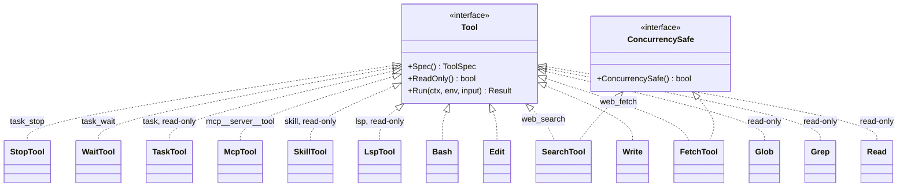
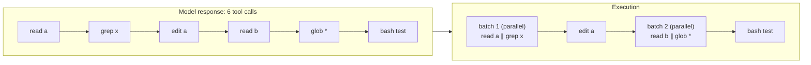
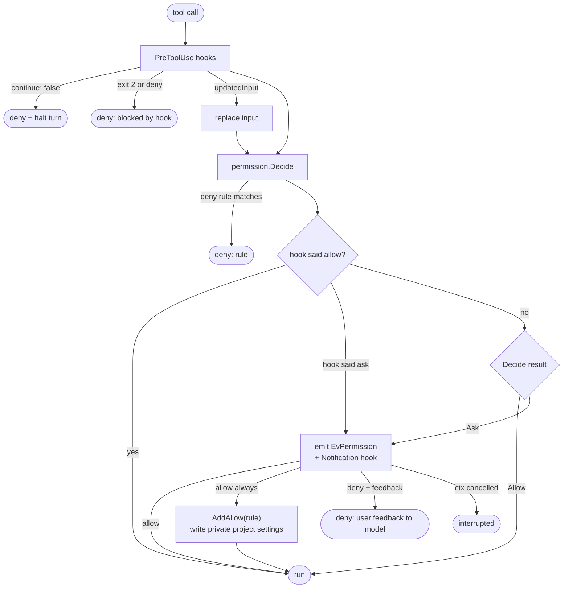
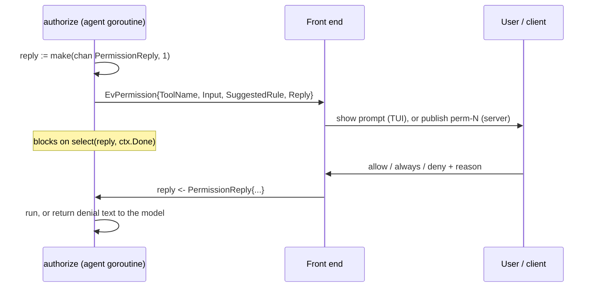

# Tools and permissions

## The Tool interface

Every capability the model can use, built-in or not, implements three methods ([tool.go](../internal/tools/tool.go)):

```go
type Tool interface {
    Spec() llm.ToolSpec                                            // name, description, JSON Schema
    ReadOnly() bool                                                // never modifies state
    Run(ctx context.Context, env *Env, input json.RawMessage) Result
}

type Result struct {
    Content string // what the model sees
    IsError bool
    Display string // richer rendering for the UI only, e.g. a diff
}
```

`ReadOnly` does double duty: read-only tools skip permission checks (except deny rules), run in plan mode, and may run in parallel. A tool that changes nothing locally but still needs approval, like `web_fetch`, can implement `ConcurrencySafe() bool` to run in parallel anyway.



| Tool | Package | Read-only | Notes |
|---|---|---|---|
| `read` | tools | yes | Line-numbered; records the file's mtime; warms up the language server |
| `write`, `edit` | tools | no | Confined to the project, with protected paths and symlinks rejected; refuse stale overwrites; require an undo snapshot; append LSP diagnostics |
| `bash` | tools | no | 120 s default, 600 s max; runs in the sandbox unless `"sandbox": false`; kills the whole process group on cancel; optional `checkpoint_paths` snapshots named project files for `/undo` |
| `raw_output` | tools | yes | Reads bounded byte ranges of exact bash output captured while `token_saver` is enabled; does not rerun the command |
| `grep`, `glob` | tools | yes | ripgrep when installed, a Go fallback otherwise |
| `todo_write` | tools | yes | Replaces the model's task list; at most one item `in_progress`. Stateless: the latest successful call in the transcript is the list, so the TUI, resume and `/todos` read it from there, and compaction carries open items into the summary. Not offered to subagents |
| `web_fetch`, `web_search` | web | no (concurrency-safe) | Per-domain permission; see [security](security.md#web-tools) |
| `lsp` | lsp | yes | definition, references, hover, symbols, diagnostics |
| `skill` | skills | yes | Loads a skill's full instructions |
| `mcp__<server>__<tool>` | mcp | only with `readOnlyHint` and not `openWorldHint` | Adapter over an MCP server's tool |
| `task`, `task_wait`, `task_stop` | subagent | yes | Child calls are checked one by one; plan mode rejects task worktree creation |
| `exit_plan_mode` | agent | yes | Presents a plan. `Decide` always asks for it in plan mode (and allows it elsewhere); the prompt is the approval, and the reply's `Mode` (accept-edits or default) is applied by `authorize`. An empty plan is refused before asking. Not offered to subagents |

Tool output sent to the model is capped (`tools.MaxOutputBytes`, about 30 KB); `Truncate` keeps the head and the tail, since errors usually appear at the end.

`token_saver` is off by default and can be enabled in personal settings or `/config`. It filters recognized successful bash output only after execution. Unknown formats, shell pipelines, full patches, failures, and timeouts keep their original output. Exact stdout/stderr is stored in a private per-session sidecar (mode `0700` directory, `0600` files), including across resume and forks. Use `raw_output` with `tool_call_id`, `offset` (zero-based bytes), and `limit` (up to 20,000 bytes) to inspect it. A bash call's `raw_output: true` bypasses filtering. Byte counts in filtered output are estimates of the reduction in command output sent to the model; provider usage remains the source for session token and cost totals.

## Env: the shared state tools run in

`tools.Env` ([tool.go:33](../internal/tools/tool.go:33)) is created per agent and holds the hooks that connect tools to the rest of Larik without tools importing those packages:

| Field | Set by | Used for |
|---|---|---|
| `Cwd` | agent | Resolving relative paths |
| `BeforeWrite(path) error` | agent → `checkpoint.Store.Capture` | Snapshot before the first write in a turn; failure stops the write |
| `Diagnostics(ctx, path)` | agent → `lsp.Manager.Diagnostics` | Compiler errors appended to edit/write results |
| `Touch(path)` | agent → `lsp.Manager.Touch` | Open a file in its language server after a read |
| `Sandbox` | app | Confining `bash` |
| `reads` | `read` tool | The read-before-write freshness check |

**Read-before-write.** `checkFresh` ([tool.go:77](../internal/tools/tool.go:77)) rejects a write or edit to an existing file unless the agent read it first and its mtime hasn't changed since. The model can't overwrite content it hasn't seen, and it notices when you edited a file under it.

## Execution order

`runTools` ([runtools.go:24](../internal/agent/runtools.go:24)) handles all tool calls from one model response in two phases:

1. **Authorize, in order.** Each call goes through `authorize`, one at a time, because asking the user is interactive. Unknown tools, malformed input and denials become error results immediately.
2. **Execute, batched.** Approved calls are grouped into runs of consecutive parallel-safe tools. Each run executes concurrently; anything else (write, edit, bash) runs alone. Results are placed at their original index.



The results go back as one user message with six `tool_result` blocks in the original order. This keeps a model's "read these five files" fast while preserving the order of anything with side effects.

After each tool runs, `PostToolUse` hooks can append feedback or context to the result, or halt the turn ([runtools.go:73](../internal/agent/runtools.go:73)).

## Authorization

`authorize` ([runtools.go:104](../internal/agent/runtools.go:104)) combines hooks, rules and the mode. The precedence is:

**hook deny > rule deny > hook allow / ask > mode and allow rules > ask the user**



### permission.Decide

[permission.go:161](../internal/permission/permission.go:161), in order:

1. `write`/`edit` outside the project, through a symlink, or to a protected project file → Deny (even in yolo).
2. Any **deny rule** matches → Deny. (Applies in every mode, including yolo.)
3. Mode **yolo** → Allow.
4. Tool is **read-only** → Allow.
5. Mode **plan** → Deny, except `web_fetch`/`web_search`, which fall through to ask (research is part of planning).
6. Any **allow rule** matches → Allow.
7. `bash` and the **sandbox** is on and the call didn't set `"sandbox": false` → Allow.
8. `bash` and the command is on the **safe list** (`ls`, exact `git status`, exact `git diff`, …) with no shell operators → Allow.
9. `write`/`edit` in **accept-edits** mode inside the working directory → Allow.
10. Otherwise → **Ask**.

### Rules

Rules are `tool` or `tool(pattern)`. The pattern matches a *subject* taken from the input ([permission.go:132](../internal/permission/permission.go:132)):

| Tool | Subject | Pattern style | Example |
|---|---|---|---|
| `bash` | the command | `*` wildcard | `bash(go test*)` |
| `read`, `write`, `edit`, … | the path, relative to cwd when inside it | doublestar glob | `edit(docs/**)` |
| `web_fetch` | the URL's host | `domain:` plus subdomains | `web_fetch(domain:go.dev)` |
| `mcp__server__tool` | none | whole-tool or whole-server | `mcp__github` |

Bash patterns are prefixes, so Larik checks every command in a command line. An allow rule covers a chained or piped command (`;`, `&&`, `||`, `|`, `&`, subshells) only when each command in it matches an allow rule. A command substitution (`$(…)`, backticks) or a redirection to a file always asks; `2>&1` and redirections to `/dev/null` don't count. A deny rule applies to each command too, so `bash(rm*)` also stops `true; rm -rf x` and `echo $(rm x)`. Quoting isn't parsed: an operator inside quotes splits the line as well, which only makes Larik ask. The bare rule `bash` still allows everything. Deny rules match the command as written, so `/bin/rm` or `command rm` isn't `rm*`; rely on the sandbox, not deny patterns, to contain commands.

`read(...)` deny rules apply to the `read` tool and to `@` mentions. They don't reach `grep` or `glob` searches over a directory that contains the file, or sandboxed `bash` (the sandbox can read everything, and `cat`, `head` and `tail` are auto-allowed outside it). Treat them as a guard against the model reading a file by accident, not as a boundary; keep secrets out of the project.

"Always allow" proposes a rule with `SuggestRule`: `bash(git commit*)` for tools with subcommands (git, go, npm, cargo, …), `bash(make*)` otherwise, the domain for `web_fetch`, and the bare tool name for everything else. The answer is added to the in-memory checker and written to private project settings under `~/.config/larik/projects/`. If saving fails, the rule remains active for the session and Larik emits a notice; the HTTP reply also reports `persisted: false` and the error.

`Checker.WithCwd` gives a worktree subagent a checker that shares the parent's mode and rules (one `state` pointer) but resolves paths against the worktree. Switching mode with shift+tab applies to running subagents too.

### The permission round trip



The agent goroutine blocks until someone answers or the turn is cancelled. Headless mode answers "deny" at once. The server keeps the reply channel in a pending map until a client answers, and expires it with `permission_resolved: expired` when the run ends.

## Modes at a glance

| Mode | Read-only tools | Edits in cwd | Sandboxed bash | Unsandboxed bash | Web | Deny rules |
|---|---|---|---|---|---|---|
| `default` | run | ask | run | ask (safe list runs) | ask | enforced |
| `accept-edits` | run | run | run | ask (safe list runs) | ask | enforced |
| `plan` | run | denied | denied | denied | ask | enforced |

In plan mode each prompt carries a short `<system-note>` saying so (in the user message, not the system prompt, so the cached prefix doesn't change), and the first prompt after plan mode ends says it has ended.
| `yolo` | run | run | run | run | run | enforced |
